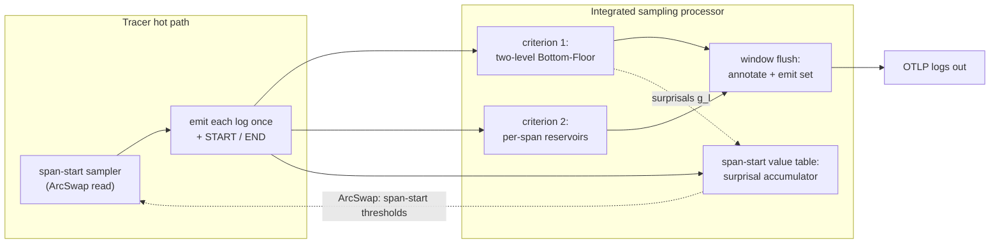
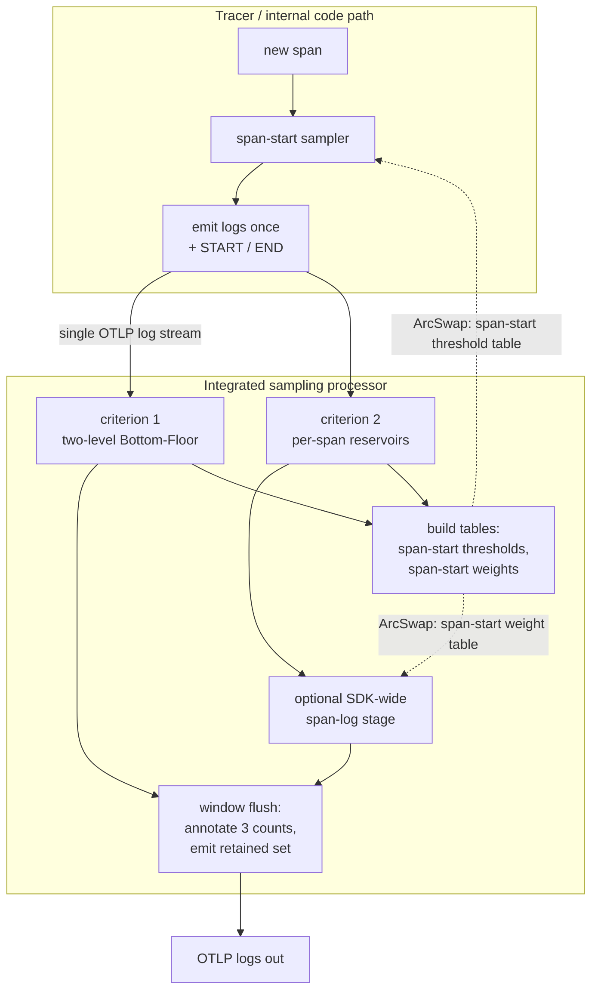

# Integrated Logs and Traces Reservoir Sampling: Design

## Status

Partially implemented. This document specifies an integrated sampler for the
OTAP-Dataflow internal telemetry system that samples logs and traces together
under fixed budgets, and emits standard OpenTelemetry logs that carry their own
sampling weights.

The sampling library and its statistical core are implemented in the
`otap-df-telemetry` crate under
[`self_tracing::sampling`](../crates/telemetry/src/self_tracing/sampling/README.md):
the Bottom-Floor weighted bottom-k sampler, the span-start sampler with its
`ArcSwap` threshold table and target-rate feedback, the windowed integrated
processor with the three estimators and exact-zero adjusted-count output, and
the `SpanContext` extensions.

The engine mechanism that drives this library from real telemetry is specified
and built; see
[`integrated-sampler-engine-mechanism.md`](integrated-sampler-engine-mechanism.md).
The data-plane span-context propagation, the per-worker thread-local sample
buffer, and the all-CPU aggregator are implemented. The aggregator is built into
the Internal Telemetry Receiver, which combines the per-worker samples and
republishes both feedback tables; the tracer's span-start sampler and each
worker's heavy-hitter binding gate read them, closing the intra-process two-level
loop. Remaining: smoothing the global counts across windows, the cross-process
two-level log feedback, and the optional SDK-wide span-log second stage.

## Audience and scope

The audience is contributors who will build or review internal telemetry
sampling. The document is self-contained. It re-specifies the logs-side
Bottom-Floor algorithm and its two-level extension in full, so no external
reading is required. It then specifies the trace side and the integration of
the two.

The design builds on two existing documents:

- [Self-Tracing Spans: Design and Implementation](self_tracing_spans_design.md)
  defines the `Sampler` trait, the no-allocation `SpanContext`, and the OTEP
  235 `Threshold` and `Randomness` types. This document extends that work.
- [Internal Telemetry Logging Pipeline](self_tracing_architecture.md) defines
  the partial OTLP-bytes `LogRecord` path and the provider modes that carry
  internal telemetry. Spans and sampled logs reuse that path.

The statistical mechanism originates in the Bottom-Floor study and in an
earlier two-level log-sampling proof of concept. This document restates their
results so the reader does not need them, and credits them as the origin of the
algorithm.

## Contents

- [Background](#background)
- [The operator's question and the cost model](#the-operators-question-and-the-cost-model)
- [Stage one: the Bottom-Floor local sampler](#stage-one-the-bottom-floor-local-sampler)
- [Stage two: two-level backpressure](#stage-two-two-level-backpressure)
- [The integrated model](#the-integrated-model)
- [The trace side: span-start sampling](#the-trace-side-span-start-sampling)
- [The hot-path and processor split](#the-hot-path-and-processor-split)
- [Criterion one: global-independent log sampling](#criterion-one-global-independent-log-sampling)
- [Criterion two: the per-span reservoir](#criterion-two-the-per-span-reservoir)
- [The span-start-callsite weight table](#the-span-start-callsite-weight-table)
- [Output encoding and exact-zero semantics](#output-encoding-and-exact-zero-semantics)
- [Architecture](#architecture)
- [Concurrency, windows, and staleness](#concurrency-windows-and-staleness)
- [Configuration](#configuration)
- [Reuse and extension of the spans work](#reuse-and-extension-of-the-spans-work)
- [Open design decisions](#open-design-decisions)
- [Scope, non-goals, and future work](#scope-non-goals-and-future-work)

## Background

Internal telemetry from a busy engine follows a heavy-head, long-tail
distribution. A few callsites are extremely chatty while very many are rare.
Naive head limiting loses the tail. Naive uniform sampling drowns the tail
under the head. The same shape holds for spans: a few span-start callsites
dominate while many are rare.

We want one design that samples logs and spans together, keeps the rare tail,
spends a fixed budget per unit of time, and produces output whose counts are
statistically meaningful. The output is the ordinary OpenTelemetry logs data
model. Sampling weights ride along as attributes, so any consumer that ignores
the attributes still sees valid logs, and a consumer that understands them can
recover unbiased totals.

The design has three estimators that operate over one shared stream of records:

1. A global-independent log sampler over every log event.
2. A span-start sampler that selects whole spans by their start callsite.
3. A per-span log reservoir that samples the logs inside each selected span.

Each estimator is a separate population with its own adjusted-count attribute.
The rest of this document specifies each one and how they compose.

## The operator's question and the cost model

Before any mechanism, we fix what sampling costs, because that is the axis the
design optimizes.

The unit we sample and count is a **callsite**, a hashable identifier for where
in the program an event came from. For a log it is the log statement. For a
span it is the span-start statement. Within a fixed time window a process emits
anywhere from hundreds to many millions of events across a large and growing
set of callsites. At the end of each window we keep a small sample together
with an estimate of how many times each kept callsite actually fired.

The constraints that shape the design are these.

| Requirement | What it means |
| --- | --- |
| Fixed space | Memory is bounded by a single number and never grows with how many distinct callsites have been seen. |
| Unknown rate | The number of events per window is not known ahead of time and varies widely. |
| Unknown type count | The number of distinct callsites is not known and grows over time. |
| Heavy long tail | A few callsites are very frequent and very many are rare. |
| One parameter | The operator sets a single budget and everything else is derived. |

Recall is by callsite type, not by volume. A callsite is **recalled** at a
given budget if at least one of its records survives. The question is whether
we kept evidence the callsite fired this window, not how many of its records we
kept. A head callsite with millions of records is recalled even if we keep one.
A rare callsite with a single record is lost the moment that record is dropped.

Each callsite is weighted by its **surprisal**. Let `p_c = n_c / total` be the
empirical probability that a random record belongs to callsite `c`. The
surprisal of one occurrence of `c` is

```text
w_c = -ln(p_c) = ln(total / n_c)
```

measured in nats. A head callsite has `p_c` near one, so `w_c` is near zero:
losing it costs almost nothing. A callsite seen once in millions of records
carries fifteen or more nats: losing it is dear. This is the per-symbol term
inside Shannon entropy.

The cost metric is surprisal-weighted recall loss against the unsampled data.
For a sampling rate `r`,

```text
loss(r) = sum_c w_c * [c not recalled at rate r] / sum_c w_c
```

The numerator is the total surprisal of the callsites that vanished entirely.
The denominator normalizes the loss to lie between zero and one. The metric is
dominated by the many low-probability tail callsites, so it is by construction
almost entirely a tail-recall score. On real production logs this loss sheds
the high-volume head almost for free: keeping about one percent of the volume
discards ninety-nine percent of records while losing close to none of the rare
statements an on-call engineer needs. Only very deep cuts, far below any rate
an operator would pick for volume reduction, lose rare information.

This is the behavior we want from every level of the integrated sampler: a
volume knob that the operator can turn down and pay only in head redundancy,
not in rare information, until the budget is genuinely too small.

## Stage one: the Bottom-Floor local sampler

This section states the local sampling algorithm in full. It is standard
bottom-k sampling with the Horvitz-Thompson inclusion correction and one extra
rule, the rarest-seen floor, that protects the tail. Every level of the
integrated design is an instance of this algorithm.

### Notation

A window is one fixed time interval. All quantities are per window unless
stated otherwise.

| Symbol | Meaning |
| --- | --- |
| `c` | A callsite, the unit we sample and count. |
| `n_c` | The true number of arrivals of callsite `c`. |
| `k` | The memory budget; the sample holds `k` items. The single user parameter. |
| `w_c` | The sampling weight of `c`. Larger weight means more likely to keep. |
| `u` | A fresh uniform random number in `(0, 1]`, drawn once per arrival. |
| `key` | The priority of one arrival; smaller key means higher priority to keep. |
| `tau` | The keep threshold; an arrival is kept when its key is below `tau`. |
| `pi_c` | The probability one arrival of `c` is kept, given `tau`. |
| `m_c` | The number of arrivals of `c` actually kept, so `m_c <= n_c`. |
| `nhat_c` | The estimated count of `c`, corrected for its keep probability. |
| `w_unseen` | The weight used for a callsite not seen in the previous window. |

### Bottom-k keys and the adaptive threshold

For each arrival of callsite `c`, draw a fresh uniform `u` and form an
exponential key:

```text
key = -ln(u) / w_c
```

A larger weight makes the key smaller on average, so heavier-weighted callsites
are more likely to be kept. The probability that one arrival's key falls below
a threshold `tau` is exactly

```text
pi_c = Pr[key < tau] = 1 - exp(-tau * w_c)
```

The sampler keeps the `k + 1` smallest keys seen so far in the window and uses
the value of the `(k + 1)`-th key as the threshold `tau`. The threshold is not
configured. It falls out of the data as whatever the `(k + 1)`-th key happens
to be, which is how the sampler adapts to an unknown arrival rate without a
fixed probability. When many heavy arrivals come, the keys are small and `tau`
settles low. When traffic is sparse, `tau` rises.

### The inclusion correction

A kept count `m_c` understates `n_c` because some arrivals were not kept. The
Horvitz-Thompson correction divides by the keep probability:

```text
nhat_c = m_c / pi_c = m_c / (1 - exp(-tau * w_c))
```

If each of `n_c` arrivals is kept with probability `pi_c`, then on average
`n_c * pi_c` are kept, and dividing the observed kept count by `pi_c` recovers
`n_c` on average, so `nhat_c` is unbiased. Keeping `k + 1` rather than `k` keys
is what lets `tau` be treated as a fixed cutoff: lowering the keys of the items
that were kept cannot change which key sits in position `k + 1`, because those
items were already below it. Because the correction is unbiased for every
callsite separately, it is unbiased for any sum of callsites, which is the
group-total guarantee. It holds for any choice of weights, so the weights are
free to serve coverage.

### Inverse-frequency feedback and equal coverage

The expected kept count of `c` is `E[m_c] = n_c * pi_c`. Whenever `k` is much
smaller than the number of arrivals, `pi_c` is approximately `tau * w_c`, so
`E[m_c]` is approximately `tau * n_c * w_c`. Choosing the weight to be the
inverse of the count,

```text
w_c = 1 / n_c
```

gives `E[m_c]` approximately equal to `tau` for every callsite, frequent or
rare. That is equal coverage: the same expected number of kept slots per
callsite. Since the kept counts sum to about `k` across the callsites present,
`tau` is about `k / S` where `S` is the number of distinct callsites, the
per-callsite share of the budget.

We do not know `n_c`, but we estimated it last window, so we close the loop:

```text
w_next_c = 1 / nhat_c
```

This is the entire self-calibration. Each window produces counts; the counts
set the next window's weights; the weights drive the sampling toward equal
coverage within a few windows. There is no configured rate and no assumption
about the population.

### The floor for unseen callsites

A callsite appearing for the first time has no weight. It must be kept at a
rate at least as high as the rarest callsite already tracked, otherwise
brand-new behavior would be systematically harder to catch than the rarest
known traffic. Using only quantities the sample provides, the smallest weight
consistent with that rule is the largest weight currently in the map:

```text
w_unseen = max over kept c of w_next_c = 1 / (smallest nhat_c)
```

This is the **rarest-seen rule**. It puts a floor under the inclusion
probability of anything new, and that floor is what gives Bottom-Floor its name
and what protects the rare tail. It is a single extra scalar, not a growing
list, so it respects the fixed-memory and single-parameter constraints.

### The complete local algorithm

The persistent state between windows is a weight for each kept callsite, at
most `k` of them, plus the single scalar `w_unseen`. The per-window threshold
`tau` is recomputed each time.

Per arrival:

```text
w = weight_map.get(c, w_unseen)      # O(1) hash lookup
if w <= 0:
    return                           # skip; no further work for this event
u = uniform(0, 1)
key = -ln(u) / w                     # smaller key = higher priority to keep
if heap.size < k + 1:
    heap.push(key, c)
elif key < heap.largest_key():
    heap.replace_largest(key, c)
# otherwise discard
```

The discard decision is made before any expensive per-event work such as
message formatting, attribute capture, or serialization. An event that loses
the heap comparison costs only a hash lookup, a random draw, a logarithm, a
divide, and a comparison.

At window end:

```text
boundary = heap.pop_largest()        # the (k+1)-th smallest key
tau = boundary.key
sample = heap                        # exactly k items

for each callsite c in sample:
    m_c = number of kept arrivals of c
    w   = weight_map.get(c, w_unseen)
    pi  = 1 - exp(-tau * w)
    nhat_c = m_c / pi                # unbiased count
emit(nhat)                           # to the downstream consumer

weight_map = { c: 1 / nhat_c for c in sample }
w_unseen   = max(weight_map.values())   # or 1.0 if the sample was empty
heap.clear()
```

The cost is `O(k)` persistent memory, `O(log k)` per arrival, one user
parameter, and no internal tuning constants.

## Stage two: two-level backpressure

Stage one gives each process local equal coverage: it spends its `k` slots
evenly across the callsites it emits. Even per process is not even across a
fleet, and the two come apart exactly where telemetry cost lives. A callsite
that is locally rare but globally ubiquitous is kept readily by every sender,
so the fleet collects it once per process, a redundant flood. A callsite that
is locally common but globally unique is the only place that behavior exists
and must be preserved. A purely local rule cannot tell these apart. The second
stage supplies the missing fleet-wide signal.

### The collector recurses Bottom-Floor

Each process runs stage one and, at window end, emits its sample: for each kept
callsite a representative plus the unbiased local count `nhat_c`. Because
per-callsite counts and group totals are unbiased, summing representatives over
processes is an unbiased estimate of the global count:

```text
N_c = sum over processes p of nhat_c^p
```

The collector runs the same weighted bottom-k over the union of
representatives, weighting each by its carried `nhat_c`, corrects against its
own global threshold `tau_g`, and forms the global inverse-frequency weight

```text
g_c = 1 / N_c
```

with its own rarest-seen factor `g_unseen = max_c g_c`. Every property of stage
one holds one level up: bounded state, the floor, and the self-reported
uncertainty. The collector broadcasts back a bounded table: the weights `g_c`
for the few globally abundant callsites, the single scalar `g_unseen` for
everything else, and the global threshold `tau_g`.

### The binding gate

Each arrival now faces two thresholds that share the same draw `u`. The local
threshold `tau_l` is the `(k + 1)`-th key of this sender's own stream. The
global threshold `tau_g` is broadcast in the table. With one `u` and two keys,
clearing both collapses to a single condition:

```text
admit iff -ln(u) < min( tau_l * w_local_c , tau_g * g_c )
```

The scarcer of the two normalized scores binds. There is no blend parameter and
no exponent to tune. Reading the global score with `g_c = 1 / N_c` shows what
it does:

```text
tau_g * g_c = tau_g / N_c
```

`tau_g` is the global budget expressed as a per-callsite quota of
representatives. Dividing by `N_c` turns it into a per-arrival admission
pressure: the more total copies of `c` the fleet produces, the smaller
`tau_g / N_c`, and the harder the threshold pushes back on every process that
emits `c`. This is per-callsite backpressure. A globally abundant callsite is a
congested pipe, and the threshold throttles each contributor in proportion to
the congestion so the total inflow settles at the quota.

The `min` with the local threshold keeps the backpressure honest. A
locally-rare-but-globally-ubiquitous callsite is loose locally and tight
globally, so the global pressure throttles the redundant flood. A
globally-unique callsite carries `g_unseen`, so its global score is the most
permissive possible and its local quota decides it alone, so the fleet never
throttles the one place that behavior exists.

The composition costs nothing in correctness. Both thresholds are fixed
cutoffs, so the inclusion probability is

```text
pi_eff_c = 1 - exp( -min(tau_l * w_local_c, tau_g * g_c) )
```

and the same Horvitz-Thompson correction `nhat_c = m_c / pi_eff_c` keeps counts
and group totals unbiased. Composing the two signals by multiplying the weights
instead would be wrong twice over: dimensionally it multiplies two
inverse-counts into an inverse-count-squared, and statistically it double-
counts, because `N_c` already contains this process's own contribution. The
threshold composition avoids both, because each weight is normalized by the
threshold of the sample that produced it before the two ever meet.

### Forget locally, remember globally

A single sender observes its entire local stream and re-derives
`w_local_c = 1 / nhat_c` as a complete, fresh measurement every window. Stage
one is therefore deliberately memoryless. The global signal is different. `N_c`
is assembled from many processes that share no clock, whose membership churns,
and whose contributions are themselves sampled. Any one window's `N_c` is a
partial, jittery snapshot, broadcast to every sender at once, so chasing the
latest window would make the fleet over-correct in lockstep. The global level
is therefore the natural place for inertia: smoothing `N_c` with a running
average at the collector trades a little staleness for a stable fill-line the
fleet can track without ringing.

## The integrated model

The integrated sampler runs three estimators over one shared stream of records.
Each estimator is a separate population, and each contributes one adjusted-count
attribute to the output.

| Estimator | Selects | Output attribute |
| --- | --- | --- |
| Criterion one | Every log event, by log callsite | `otel.logs.adjusted_count` |
| Span sampling | Whole spans, by span-start callsite | `otel.traces.adjusted_count` |
| Criterion two | Logs inside a sampled span | `otel.span_logs.adjusted_count` |

The three estimators are independent. A record carries all three attributes,
and a value of zero on any one means the record is not a member of that
population. Because the counts live in separate attributes and a consumer sums
one attribute at a time across records, a record that one estimator did not
select contributes zero to that estimator's total and does not perturb it.

Two effective sampling criteria drive which records exist in the output and
what weights they carry:

- The first criterion samples log events by their independent callsite
  frequency, exactly the two-level Bottom-Floor sampler of the previous
  sections. This is the global-independent log population.
- The second criterion samples log events by the span that contains them. A
  span is first selected by a span-start sampler, and then the logs inside the
  selected span are sampled by a per-span reservoir. This is the span-log
  population.

Span START and END events are themselves emitted as logs, under the model from
the [spans design](self_tracing_spans_design.md) where a span surfaces as two
independent log events. They belong to the span population by construction.

The single most important encoding rule is that an adjusted count of exactly
zero is meaningful. It states that the record is present in the output but must
not be counted in that population. The [output encoding](#output-encoding-and-exact-zero-semantics)
section gives the worked example.

## The trace side: span-start sampling

Span selection reuses the `Sampler` trait and the OTEP 235 `Threshold` and
`Randomness` types from the [spans design](self_tracing_spans_design.md). The
new element is a sampler whose thresholds are keyed by span-start callsite and
recomputed each window to hit a target rate of span starts.

### Consistent probability thresholds by span-start callsite

The span-start sampler holds a table that maps each span-start callsite to an
OTEP 235 threshold. On a new span the sampler computes the span-start callsite
identity, looks up its threshold, and applies the consistent-probability test
already defined for spans: the span is sampled when `threshold <= randomness`.
A callsite not present in the table uses a default threshold.

The threshold table is wrapped in an `ArcSwap`, so the hot-path read is
wait-free and never blocks the window that rebuilds the table. The lookup
returns a `Copy` threshold, and the decision allocates nothing.

### Target-rate feedback

The thresholds are not configured per callsite. They are derived each window
from the previous window's measured span-start counts to hit a single
configured target, the number of span starts to admit per unit of time across
all callsites.

A processor counts span starts per callsite over a window using the
adjusted-count attribute already on the START events, so the count is the
estimated true number of span starts, not the kept number. Given the estimated
total span-start volume and the per-callsite breakdown, the processor assigns
each callsite a new threshold so that the expected number of admitted span
starts equals the target. The simplest assignment gives equal coverage across
span-start callsites, which mirrors the inverse-frequency weighting of the log
sampler: a chatty span-start callsite gets a tighter threshold and a rare one a
looser threshold, so the budget spreads across distinct span-start callsites
rather than being consumed by the few busiest. The next subsection refines this
baseline so the budget favors span kinds whose logs are globally rare. The
processor publishes the new table through the `ArcSwap`, and the tracer picks it
up on its next decision.

Because the table is consistent-probability, the per-span adjusted count is the
inverse of the admission probability implied by the threshold, and it is
carried on the span as `otel.traces.adjusted_count`. A child span inherits the
trace and the randomness, so the existing span sampling rules from the spans
design continue to hold; the new table only changes how root and unparented
span thresholds are chosen.

### Value-weighted coverage from the global log sample

A dedicated companion document,
[`span-start-value-sampling.md`](span-start-value-sampling.md), specifies this
algorithm self-contained and frames its divergence-reduction objective as a
research question for empirical study. This section summarizes it in the context
of the integrated sampler.

Equal coverage across span-start callsites spends the span budget without regard
to what a span reveals. At a low span-sample rate the per-span reservoir alone
cannot characterize a span kind, because it sees too few logs of each. The
global-independent log sampler does not have that problem. It observes every log
with full statistical power, and every log carries its enclosing `start_callsite`
in context whether or not its span was sampled. Grouping the global log sample by
span-start callsite therefore yields a well-estimated profile of which logs each
span kind emits, and that profile decides which span kinds are worth the budget.

The two populations relate through a contingency table over the previous window.
Its marginals and profiles name the quantities the score uses, although the
score below never materializes the joint:

```text
N[s,l] = estimated in-span count of log callsite l under span-start callsite s
n      = sum over s,l of N[s,l]
c_l    = N[.,l] / n            global frequency of log callsite l
f_s(l) = N[s,l] / N[s,.]       the log profile of span kind s
```

The centroid of the profiles is `c_l`, the global log distribution, and `c_l`
with its surprisal `g_l = -ln c_l` is already maintained by criterion one. A
span kind earns budget in proportion to the rare-log information it reveals,
which is the expected surprisal of the logs it emits:

```text
g_l = -ln c_l                    surprisal of log callsite l (from criterion one)
V_s = ( sum of g over the logs in s ) / N[s,.]   =   sum_l f_s(l) * g_l
```

`V_s` is linear in the row profile, so it never needs the joint table `N[s,l]`.
The processor accumulates it online: every emitted log adds `g_l` to a bucket
keyed by its `start_callsite` and bumps that bucket's count. Because the
processor sees every log, in sampled and unsampled spans alike, the bucket
totals are exact window values and `V_s` carries no sampling variance of its
own. The only inputs estimated elsewhere are the surprisals `g_l`, which lag by
one window.

A floor `c_min`, the rarest-seen column mass, caps `g_l` at `-ln c_min` so a
brand-new log callsite cannot make a span look infinitely precious, mirroring
the `w_unseen` rule. A span kind seen only a few times this window is noisy, so
its score is shrunk toward the global mean surprisal `H = sum_l c_l * g_l` in
proportion to how little was observed,

```text
V~_s = ( sum of g over the logs in s + kappa * H ) / ( N[s,.] + kappa )
```

which adds `kappa` pseudo-logs at the average, so an under-observed span kind
defaults to ordinary and is not boosted on the strength of one fluky rare log.

The span sampler is a stateless head decision, not a reservoir, so the value does
not become a per-arrival weight. It sets a per-callsite admission probability.
Targeting `T` admitted starts per window with admitted count per kind
proportional to value gives `A_s = V_s * T / sum_s' V_s'` and

```text
P_s = clamp( A_s / N_starts[s], 0, 1 )
    = clamp( T * V_s / ( N_starts[s] * sum_s' V_s' ), 0, 1 )
```

The `1 / N_starts[s]` is the inverse-frequency term: a chatty span kind is
throttled and a rare one is preserved, while `V_s` tilts the budget toward the
kinds whose logs carry rare information. A flat `V_s` recovers the equal-coverage
assignment exactly, so the refinement never does worse than the baseline; it
redirects budget only when span kinds genuinely differ in the rarity of the logs
they emit.

The probability becomes an OTEP 235 threshold over the 56 random bits of the
trace id:

```text
T_s = round( 2^56 * ( 1 - P_s ) )
admit a span start iff  T_s <= randomness
otel.traces.adjusted_count = 2^56 / ( 2^56 - T_s ) = 1 / P_s
```

The processor publishes the `T_s` table through the `ArcSwap`, the tracer reads
it wait-free on the next window, and a span-start callsite not yet in the table
uses the most permissive seen threshold as its default. A rare high-value kind
can clamp to `P_s = 1`, which admits every one of its starts and can push the
realized total above `T`. The first version accepts that overshoot, and a hard
ceiling on admitted starts is left to a later refinement.

#### Processor cost

The processor runs over the full emitted stream of `W` log records per window.
Per log it pays the criterion-one heap at `O(log k)`, the per-span reservoir at
`O(log r)` for a log inside a sampled span, and one `O(1)` bucket update for the
surprisal score, so per-window time is `O(W * (log k + log r))`. At the window
boundary it finalizes criterion one in `O(k)`, the per-span reservoirs in
`O(r * B)` for `B` concurrent sampled spans, and the span tables in `O(S*)` for
`S*` tracked span-start callsites.

Persistent space is `O(k)` for the log weight and surprisal tables plus `O(S*)`
for the span-start threshold table. Transient per-window space is `O(k)` for the
criterion-one heap, `O(r * B)` for the per-span reservoirs, and `O(S*)` for the
surprisal accumulator and the span-start counter. The dominant memory is
`O(k + r * B)`, exactly the log sampler and the per-span reservoirs the design
already budgets; value scoring adds only `O(S*)`, bounded by the number of
span-creation sites in the binary rather than by traffic, by `(s,l)`
cardinality, or by trace count. Fixed memory and the single budget knob are
preserved.

### SpanContext extensions

The integrated design adds two fields to the no-allocation `SpanContext`
defined in the spans design. Both keep the type `Copy` and free of heap
storage.

```rust
pub struct SpanContext {
    pub trace_id: TraceId,
    pub span_id: SpanId,
    pub flags: TraceFlags,
    pub ot: OtelTraceState,
    // New for the integrated sampler:
    /// Set when this span was selected by the span-start sampler. Distinct
    /// from the W3C sampled flag, which a parent may have set for other
    /// reasons.
    pub locally_sampled: bool,
    /// The span-start callsite identity. It keys the span-start value table
    /// over every log, the per-span reservoir, and the SDK-wide span-start
    /// weight table, so it must be present on every in-span record whether or
    /// not the span was locally sampled.
    pub start_callsite: u64,
}
```

The `locally_sampled` bit is the signal the log path needs. When a log event is
recorded, the layer reads the current span context, and if the bit is set the
event is on the span-log path. The `start_callsite` key lets the per-span
reservoir, the SDK-wide weight table, and the span-start value table attribute a
log to the span-start callsite that contains it, without carrying the span name
as a string on the hot path. The value table reads it on every in-span record,
so it is set whether or not the span is locally sampled.

### Span START and END events

START and END are kept verbatim whenever the span is locally sampled. They are
not subject to the per-span reservoir, because they are the span's own
boundary markers, so each carries `otel.span_logs.adjusted_count = 1` by
definition. Each also carries `otel.traces.adjusted_count` equal to the span's
adjusted count, so a consumer counting spans reads it off either boundary.

The END event additionally records latency. The layer stamps it with the
elapsed time between the span start and the span end, computed from the start
instant retained for the span. This is the one quantity a span must carry that
a pair of independent log events would otherwise lose, and it is recorded
directly on the END record rather than reconstructed by a consumer.

## The hot-path and processor split

The design splits work between the tracer hot path and a sampling processor, so
that the thread that produces telemetry never touches reservoir state and never
synchronizes with the window machinery.

### The hot path emits once

The hot path is the internal code path inside the tracing layer. It does only
two things that relate to sampling.

First, on a new span it runs the span-start sampler. That is a single wait-free
`ArcSwap` read of the threshold table and a consistent-probability comparison.
The result sets the `locally_sampled` bit and the `start_callsite` key in the
span context.

Second, for a locally-sampled span it emits every in-span log event, plus the
START and END events, each exactly once. There is no reservoir on the hot path
and no per-span buffer. The cost of a sampled span is the cost of formatting and
emitting its logs, which is the cost the operator has chosen to pay by sampling
that span. Logs in a span that was not locally sampled, and logs outside any
span, are emitted once as ordinary log records.

The crucial property is that a log is emitted exactly once. It is never
duplicated per criterion. The downstream processor decides which populations a
record belongs to; the hot path only decides whether a record exists.

### The processor maintains the reservoirs and the value table

A single integrated sampling processor consumes the one emitted stream and
maintains three estimators at once over it:

- The criterion-one reservoir, a two-level Bottom-Floor sampler keyed by log
  callsite over every log record it sees.
- The criterion-two reservoirs, one fixed-size per-span reservoir per `span_id`
  for the current window, fed only by records whose span context has the
  `locally_sampled` bit set.
- The span-start value table, a surprisal accumulator keyed by `start_callsite`
  over every in-span record plus a span-start counter over START events, which
  together build the next window's span-start threshold table. The feedback
  wiring is shown in the [Architecture](#architecture) section.

The processor keeps a single retained set of records. A record may be retained
because criterion one kept it, because criterion two kept it, or because both
did. At the window boundary the processor flushes its entire retained set
downstream, annotating each record with all three adjusted counts. Nothing is
emitted mid-window, and nothing carries over between windows except the small
persistent weight maps the algorithm requires.

Because all sampling state lives in this one processor, there is no shared
mutable sampling state between threads. The hot path writes records into the
pipeline; the processor owns the reservoirs.



## Criterion one: global-independent log sampling

Criterion one is the two-level Bottom-Floor sampler of stages one and two,
applied to every log record the processor sees, in or out of a span. Its
callsite is the log statement identity. Its output is
`otel.logs.adjusted_count`, the Horvitz-Thompson count under the binding
inclusion probability.

This estimator is a complete, independent sample over the whole log stream. It
does not skip in-span logs. A log inside a sampled span is still a candidate for
criterion one, and if criterion one keeps it the record carries a positive
`otel.logs.adjusted_count`. If criterion one does not keep it, the record
carries `otel.logs.adjusted_count = 0`, which states it is not a member of the
global-independent population.

Setting that zero on records that criterion one did not keep does not bias the
estimator. Criterion one sampled the whole population independently and its
total is the sum of `otel.logs.adjusted_count` over all records. A record with
a zero contributes nothing to that sum. The extra records that exist only
because the span path kept them are, from criterion one's point of view, simply
records it did not select, correctly carrying zero.

Criterion one participates in the two-level feedback. Its representatives carry
their local `nhat_c` to a collector that runs the global reservoir and returns
the heavy-hitter table, exactly as in stage two. The binding gate and the
return path are unchanged from that section.

## Criterion two: the per-span reservoir

Criterion two samples the logs inside each locally-sampled span. For each
`span_id` present in the current window, the processor creates one fixed-size
reservoir of size `r`, where `r` is the configured number of logs to keep per
span per window. The reservoir fills by uniform bottom-`(r + 1)` sampling on the
per-record randomness, which is the same exponential-key reservoir as stage
one with a uniform weight, because within a single span every record shares one
span-start callsite and therefore one weight.

The consequences of a per-span reservoir of fixed size are deliberate:

- A short span that emits fewer than `r` logs keeps all of them, each with
  `otel.span_logs.adjusted_count = 1`.
- A long span that emits more than `r` logs keeps `r` representatives, each
  with `otel.span_logs.adjusted_count` equal to the Horvitz-Thompson count
  `n_in_span / r` on average, so the span's total log volume is recoverable.
- Longer spans therefore log more in absolute terms, which is usually what an
  operator wants: a long, interesting span keeps a richer trace of itself.
- The total span-log output is bounded by `r` times the number of concurrent
  sampled spans in a window, independent of how chatty any one span is.

The per-span reservoir keys by `span_id`, but it does not accumulate across
windows. At the window boundary each per-span reservoir is finalized into its
representatives and their adjusted counts, and the per-span state is discarded.
A span that spans several windows is sampled independently in each, which keeps
memory bounded by the concurrent span count rather than by span lifetime.

### The optional SDK-wide second stage

The per-span reservoir bounds output per span, but the total across many
concurrent spans can still be large. An optional second stage bounds the
span-log output SDK-wide. It is a second Bottom-Floor gate, applied to the
span-log representatives, keyed by span-start callsite and weighted by the
[span-start-callsite weight table](#the-span-start-callsite-weight-table).

The second stage reuses each record's original randomness `u`, the same draw the
per-span reservoir used. Reusing `u` makes the two stages consistent: a record
kept by the per-span reservoir is kept by the second stage exactly when its `u`
clears the tighter of the two thresholds. The composition is the binding gate
of stage two, and the final `otel.span_logs.adjusted_count` is the
Horvitz-Thompson count under the binding inclusion probability

```text
pi_eff = 1 - exp( -min( tau_span , tau_sdk * weight_start_callsite ) )
```

where `tau_span` is the per-span reservoir threshold and `tau_sdk` is the
SDK-wide threshold. The second stage is optional because many deployments are
already bounded well enough by the per-span size and the concurrent span count.
When it is disabled the span-log count is the per-span count alone.

## The span-start-callsite weight table

This table is distinct from the span-start threshold table of the trace side.
The threshold table selects whole spans at START by their surprisal value `V_s`;
this weight table throttles span logs SDK-wide by volume. Both key on span-start
callsite but serve different stages.

The optional second stage needs a weight per span-start callsite. That weight
is computed by the Bottom-Floor method, one level up from individual logs, over
all spans in a window.

The processor maintains, per window, statistics keyed by span-start callsite:
the number of span-log records attributed to each span-start callsite and the
rarest-seen floor across those callsites. From these it forms an
inverse-frequency weight

```text
weight_start_callsite = 1 / nhat_span_logs_for_callsite
```

with the rarest-seen floor for any span-start callsite not yet seen, exactly as
the local log sampler forms its weights. A span-start callsite that produces a
large volume of logs across all its spans gets a small weight and is throttled
SDK-wide; a rare span-start callsite gets a large weight and is preserved. The
table is published through an `ArcSwap` and consulted by the second stage on the
next window.

This is the same inverse-frequency, rarest-seen Bottom-Floor machinery as the
log sampler, applied to a different population: log events grouped by the
span-start callsite of the span that contains them, rather than by their own log
callsite. It spends the SDK-wide span-log budget evenly across span-start
callsites, so a few chatty kinds of span do not crowd out the logs of rare
kinds of span.

## Output encoding and exact-zero semantics

The output is the ordinary OpenTelemetry logs data model. Sampling weights are
carried as log attributes, so a consumer that ignores them sees valid logs and
a consumer that understands them recovers unbiased totals. There are three
adjusted-count attributes, one per population.

| Attribute | Population | Meaning of the value |
| --- | --- | --- |
| `otel.logs.adjusted_count` | Global-independent logs | Estimated number of log arrivals this record represents in the whole log stream. |
| `otel.traces.adjusted_count` | Spans | Estimated number of spans this record's span represents. |
| `otel.span_logs.adjusted_count` | Span logs | Estimated number of in-span log arrivals this record represents within its span. |

The three counts carry independent meaning. The global-independent count is a
property of the whole log stream. The span count is a consistent-probability
property of the span. The span-log count is a property of the logs within one
span. A consumer chooses a population and sums its attribute across records;
the consumer never adds counts from different attributes together.

### Exact zero is meaningful

An adjusted count of exactly zero is not missing data. It is an explicit
statement that the record is present in the output but must not be counted in
that population. This is what lets a single emitted record participate in some
populations and not others without ambiguity, and what keeps each population's
total exact.

The two directions of the rule are:

- A record selected by the span path but not by the global-independent sampler
  carries `otel.logs.adjusted_count = 0`. It is not a global sample. It may
  still be displayed as an ordinary event, and it carries its span and span-log
  counts.
- A record that is a global sample outside any sampled span carries
  `otel.traces.adjusted_count = 0` and `otel.span_logs.adjusted_count = 0`. It
  is not part of any span population.

### Worked example

Consider a log statement that fires inside a span. The span was selected at a
one-in-ten rate, so its `otel.traces.adjusted_count` is 10. The log was kept by
the span's per-span reservoir at a one-in-ten in-span rate, so its
`otel.span_logs.adjusted_count` is 10. The global-independent sampler did not
select this particular record, so its `otel.logs.adjusted_count` is 0.

```text
otel.logs.adjusted_count        = 0
otel.traces.adjusted_count      = 10
otel.span_logs.adjusted_count   = 10
```

This record is not counted in the global log population, because it was
selected from span events rather than by the independent log sampler. It can
still be shown as an ordinary event. It counts as ten span-log arrivals within
its span, and its span counts as ten spans.

The opposite case is a globally sampled log that is not inside any sampled span:

```text
otel.logs.adjusted_count        = 50
otel.traces.adjusted_count      = 0
otel.span_logs.adjusted_count   = 0
```

This record represents fifty log arrivals in the global-independent population
and belongs to no span population, so its span and span-log counts are
explicitly zero.

A record kept by both the global-independent sampler and the span path carries
positive values in both `otel.logs.adjusted_count` and
`otel.span_logs.adjusted_count`. There is no suppression between the two,
because they are separate populations summed independently.

### A note on attribute keys

The attribute keys above are written `otel.logs.adjusted_count`,
`otel.traces.adjusted_count`, and `otel.span_logs.adjusted_count` for clarity.
The exact final keys are provisional and will track whatever the internal
telemetry semantic conventions settle on for adjusted counts. The design
depends only on there being three independent, separately summed count
attributes with exact-zero semantics.

## Architecture

The system has a tracer side that produces records and a processor side that
samples them, joined by two feedback tables that travel in the opposite
direction from the data.



The two dashed edges are the feedback tables. The span-start threshold table
returns to the span-start sampler so the next window's spans are selected
toward the target span-start rate. The span-start weight table returns to the
optional SDK-wide stage so the next window's span logs are throttled by
span-start callsite. Both ride an `ArcSwap`, so the producer publishes a fresh
immutable table per window and the consumers read it wait-free.

The two-level log feedback of [stage two](#stage-two-two-level-backpressure) is
a third feedback path. It carries the global heavy-hitter table from a
collection agent back to criterion one, on the OTLP response path, exactly as
described in that section. It is omitted from the diagram above to keep the
in-process picture clear; it operates across the SDK-to-agent link rather than
inside one process.

## Concurrency, windows, and staleness

- Hot path, per record. The tracer does a wait-free `ArcSwap` read of the
  span-start threshold table on a new span, and nothing else that touches
  sampling state. Emitting a log is the same operation it is today.
- Window close. The processor's reservoirs and tables are driven by the
  engine's periodic timer. Each window is independent and recomputes its
  threshold from its own data.
- Publish. Each feedback table is published by a single `ArcSwap` store of a
  freshly built immutable table per window. Readers never block the writer and
  the writer never blocks readers.
- Bounded memory. The criterion-one reservoir is `O(k)`. The criterion-two
  reservoirs are `O(r)` per concurrent sampled span, discarded at each window
  boundary, so the total is bounded by the concurrent span count. The span-start
  value table is `O(S*)`: a surprisal accumulator and a span-start counter, one
  entry per tracked span-start callsite. The tables are bounded by their
  heavy-hitter limits. No structure grows with observed cardinality.
- Staleness and fail-safe. A consumer of a feedback table degrades to the most
  permissive behavior when the table is absent or stale. An absent span-start
  threshold table means spans use the default threshold. An absent span-start
  weight table disables the optional SDK-wide stage. An absent global
  heavy-hitter table reduces criterion one to local-only sampling. In every
  case the missing table relaxes toward keeping more, never toward incorrect
  over-suppression.
- Value-score lag. The surprisal accumulator scores each log with the previous
  window's surprisals `g_l`, so log rarity trails placement by one window. When
  no surprisals are available yet the score is flat, which makes `V_s` uniform
  and recovers plain equal coverage, so the span-start table is never worse than
  its baseline during warmup.

## Configuration

The tracer side configures the span-start sampler:

| Field | Meaning |
| --- | --- |
| `target_span_starts_per_window` | The number of span starts to admit per window across all span-start callsites. |
| `span_start_threshold_channel` | The shared-table channel the tracer reads for span-start thresholds. |
| `default_span_start_threshold` | The threshold for a span-start callsite not yet in the table. |

The processor side configures the reservoirs and tables:

| Field | Meaning |
| --- | --- |
| `interval` | Window length, for example `"5s"`. |
| `logs_per_span_per_window` | The per-span reservoir size `r`, criterion two. |
| `k_logs` | The criterion-one Bottom-Floor budget. |
| `enable_span_value_weighting` | Whether span-start thresholds are weighted by the surprisal value `V_s`; off falls back to equal coverage. |
| `span_value_shrinkage` | The pseudo-count `kappa` pulling an under-observed span kind's score toward the average surprisal. |
| `span_start_threshold_channel` | The channel to publish the span-start threshold table on. |
| `span_log_weight_channel` | The channel to publish the span-start weight table on, for the optional SDK-wide stage. |
| `enable_sdk_wide_span_log_stage` | Whether the optional second stage runs. |

The two-level log feedback adds the same `sampling_feedback_channel` settings on
the OTLP receivers and exporters that the two-level log sampler already defines,
for criterion one.

## Reuse and extension of the spans work

The integrated sampler reuses the following from the
[spans design](self_tracing_spans_design.md) without change:

- The `Sampler` trait and the `evaluate` driver. The span-start sampler is a
  `Sampler` whose thresholds come from the `ArcSwap` table.
- The OTEP 235 `Threshold` and `Randomness` types and their hexadecimal
  encodings.
- The two-log-events span model, where a span surfaces as a START and an END
  log record, and the layer that emits them.
- The `LogRecord.trace` field and the OTLP trace-field encoding, which already
  carry the span context on every in-span record.

It extends that work in the following ways:

- `SpanContext` gains the `locally_sampled` bit and the `start_callsite` key,
  staying `Copy` and allocation-free.
- The layer reads the `locally_sampled` bit to route in-span logs onto the
  span-log path and stamps the START and END events with the span and span-log
  counts and the END latency.
- A new integrated sampling processor maintains both log reservoirs and builds
  the two in-process feedback tables.
- The two-level log sampler and its OTLP response-path feedback provide
  criterion one.

## Open design decisions

These points are settled enough to build a first version but are flagged for
review.

- Span-start callsite identity. The implementation derives the key from the
  Tokio `tracing` callsite `Identifier`, the canonical per-site identity the
  tracing system already assigns, folded into a 64-bit value through its stable
  hash. This is more specific than the span name, because it distinguishes two
  same-named spans created at different sites, and needs no string hashing on
  the hot path. Because the key is process-local and is never serialized, its
  pointer-based, per-run nature is not a limitation. A name-based FNV-1a hash
  (`span_start_identity`) is retained for any future cross-process or persisted
  use, where name-based identity is the comparable one, mirroring the
  metric-identity philosophy; an alternative is to hash `file:line`.
- Span-start threshold feedback transport. The recommendation is a
  process-local `ArcSwap` registry keyed by channel name, the same pattern the
  two-level log table already uses for co-located nodes. No OTLP wire codec is
  needed, because the tracer and the processor that computes the table are in
  the same process. A cross-process target rate would need a return-path codec
  like the log heavy-hitter table.
- START parity with END. The recommendation is that both START and END carry
  `otel.span_logs.adjusted_count = 1` and `otel.traces.adjusted_count` equal to
  the span count, with END additionally carrying latency. An alternative emits
  the span count only on START and the latency only on END, which is leaner but
  forces a consumer to join the two events to read the span count.
- The optional SDK-wide span-log stage. It is specified as optional and may be
  deferred to a later milestone. The per-span size and the concurrent span
  count already bound output in many deployments. The open question is the
  default for `enable_sdk_wide_span_log_stage` and whether the span-start weight
  table should be built unconditionally so the stage can be turned on without a
  warmup window.
- Target-rate threshold assignment. The baseline is equal coverage across
  span-start callsites, which mirrors the log sampler's inverse-frequency
  weighting. The recommended refinement weights that coverage by the surprisal
  of the logs each span kind emits, so the budget favors span kinds that yield
  globally rare logs; see [Value-weighted coverage from the global log
  sample](#value-weighted-coverage-from-the-global-log-sample). Open points are
  the shrinkage strength `kappa` and whether to add a hard ceiling on admitted
  starts to bound the overshoot a clamped probability can cause.

## Scope, non-goals, and future work

In scope for the integrated design:

- Sampling logs and spans together over one emitted stream.
- Three independent adjusted-count populations with exact-zero semantics.
- Span-start sampling toward a target rate with consistent-probability
  thresholds.
- A per-span log reservoir of fixed size, with an optional SDK-wide second
  stage.
- The no-allocation hot path and the single windowed processor.

Out of scope, or deferred:

- Aggregating the emitted START, END, and in-span log records back into spans.
  That is a consumer concern, as in the spans design.
- Retaining non-OpenTelemetry `tracestate` members, which the no-allocation
  context precludes.
- Multi-agent hierarchies for the two-level log feedback, and persistence of
  any feedback table across restarts.
- A measured evaluation of the integrated sampler on real traces. The
  Bottom-Floor cost curve is established for logs; the span-start and per-span
  behavior should be measured once implemented.

Known follow-ups:

- Implement the `SpanContext` extensions and the integrated processor, then
  validate per-crate as the spans work was validated.
- Settle the provisional adjusted-count attribute keys with the internal
  telemetry semantic conventions.
- Smooth the global log counts at the collector, as the two-level study
  recommends, and consider the same inertia for the span-start threshold table.
