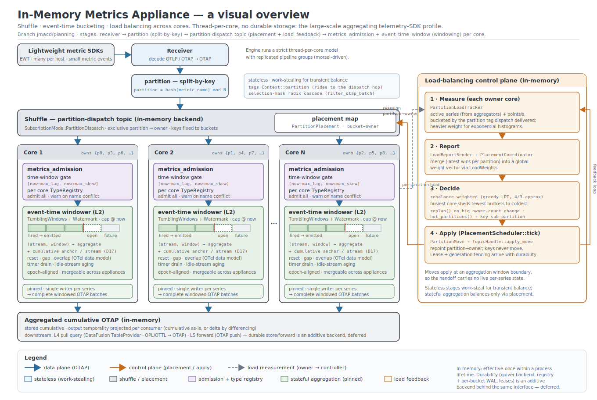

# Durable Metrics Appliance

This document sketches a durable, disconnection-tolerant metrics appliance built
on the otap-dataflow engine. It layers event-time aggregation, a queryable
timeseries store, and a pull-based query interface on top of the
vertically-integrated ingest queue, so a single node can ingest, aggregate,
store, serve, and forward metrics -- continuing to operate (and answer local
queries) while disconnected from a central observability platform.

> Status: early design; implementation beginning. The ingest queue (L1) is
> designed separately in [`ingest-queue-design.md`](./ingest-queue-design.md)
> with ratified decisions D1-D9; its **phase 0 (admission + per-core type
> registry) is implemented** as the `metrics_admission` processor. This document
> covers the layers above it (L2-L5). Its decisions (D10-D17, plus the exactly-once
> checkpoint D29) are **ratified** except the store file format, deferred to separate
> work (see "Decisions").
> Implementation has started: the **L2 event-time windowing
> core (phase A0)** -- epoch-aligned tumbling windows and per-stream watermarks
> with the on-time and lateness triggers -- is implemented in
> `crates/pdata/src/otap/windowing.rs`, and a **proof-of-concept
> `event_time_window` processor** drives it end to end over OTAP metrics
> batches. The rest is laid out in "Implementation phases". Names are provisional.

## Motivation

A telemetry collector at the edge of a network -- an appliance, a gateway, an
on-premises node -- must keep working when the link to the central platform is
slow, congested, or down. The ingest queue already makes ingest durable and
loss-tolerant across such outages. This design takes the next step: aggregate
the buffered metrics into a compact, correct timeseries form, keep that form
locally queryable, and forward it upstream when connectivity allows.

The result is a self-contained metrics appliance:

- **Durable**: data survives restarts and outages (the ingest queue and a
  second durable stage).
- **Disconnection-tolerant**: aggregation, storage, and local queries continue
  with no central dependency; forwarding resumes on reconnect.
- **Vendor-neutral and Arrow-native**: built on Apache Arrow, DataFusion, and
  OTAP, with no required external broker, database, or vendor backend (the same
  posture as the ingest queue).

This is deliberately *not* a new time-series database project, and it does not
build or depend on a database. It is a thin, vertically-integrated assembly of
primitives the engine already has: the `quiver` durable buffer for ingest, the
`temporal_reaggregation` processor for metric aggregation, a DataFusion-queried
columnar store for the aggregated timeseries, and the existing exporters for
forwarding. The engine *owns* the L1 ingest queue and *rents* the L3 store from
a neutral columnar file format behind a configurable seam.

**Durability is optional and per-location.** The shuffle/aggregate/load-balance
path runs with or without durable storage; durability is a backend choice at
each of two locations -- **stage-1** (L1, via the topic backend: in-memory or
`quiver`) and **stage-2** (L3, via the store seam: in-memory or a durable file
backend). With
durability off at both, the appliance is a large-scale aggregating telemetry SDK
(in-memory shuffle, aggregation, load-balancing, and queries); with it on, the
disconnection-tolerant appliance described here. This orthogonality is designed
in [`durable-dispatch-topic-design.md`](./durable-dispatch-topic-design.md)
(D27); "Durable" above is the durable end of that spectrum.

## Layered architecture

The master diagram below is the in-memory overview: ingress, the shuffle, the
per-core event-time bucketing, and the load-balancing feedback loop, as built on
this branch. It spans all three designs -- the ingest queue's shuffle
([`ingest-queue-design.md`](./ingest-queue-design.md)), this document's L2
windowing, and the partition-dispatch and placement of
[`durable-dispatch-topic-design.md`](./durable-dispatch-topic-design.md).



The layered view in text:

```text
  OTAP/OTLP                                                       central
  in (gRPC)                                                       platform
     |                                                               ^
     v                                                               |
 +--------+   +-----------+   +-------------+   +---------+   +-------------+
 |  L1    |   |    L2     |   |     L3      |   |   L4    |   |     L5      |
 | Ingest |-->| Event-    |-->| Aggregated  |-->| Pull    |   | Forwarding  |
 | queue  |   | time      |   | TS store    |   | query   |   | (push OTAP, |
 | (shuf- |   | windowing |   | (stage-2    |   | (OPL -> |   |  store-and- |
 |  fle)  |   | + water-  |   |  store      |   |  OTAP)  |   |  forward)   |
 |        |   | marks     |   |  seam)      |   |         |   |             |
 +--------+   +-----------+   +------+------+   +----+----+   +------+------+
 stage-1                            |
 quiver                             +-> stage-2 store, feeding L4 and L5
```

| Layer               | Role                                                        | Substrate / status                               |
| ------------------- | ----------------------------------------------------------- | ------------------------------------------------ |
| L1 Ingest queue     | Admit, shuffle by name, durable raw OTAP buffer             | ingest-queue-design.md; stage-1 `quiver`         |
| L2 Aggregation      | Event-time windowing + watermarks over shuffled streams     | `temporal_reaggregation` (processing-time today) |
| L3 Aggregated store | Complete windowed batches, keyed (name, resolution, window) | stage-2 store seam; columnar files; greenfield   |
| L4 Query (pull)     | Pull-based retrieval; metrics + sample queries (spans/logs) | DataFusion `TableProvider`; OTAP out; greenfield |
| L5 Forwarding       | Push egress to a central observability platform             | OTAP exporters (exist)                           |

The crucial enabler is L1's shuffle by metric name: once all points for a name
are co-located on one core (the ingest queue's data bucket key), event-time
windowing for that name is a purely local operation -- no cross-core exchange,
no distributed watermark coordination. L2 windows what L1 has already gathered.

## L2: Time, windowing, and watermarks

This is the heart of the appliance and the part that most needs depth. The
reference model is the Dataflow/Beam streaming model (event time, watermarks,
windowing, triggers, accumulation) adapted to the OpenTelemetry metrics data
model and to OTAP's columnar representation.

### Three clocks: event, arrival, and processing time

Every metric point carries an **event time** in its OTAP columns: data points
expose `time_unix_nano` (the point's timestamp) and, for cumulative and delta
series, `start_time_unix_nano` (the start of the accumulation interval). These
are origin timestamps, stamped by the producer.

Two other clocks exist on the path:

- **Arrival time**: when the ingest queue admitted the point (L1).
- **Processing time**: when L2 actually aggregates it.

Aggregating by arrival or processing time -- which a naive interval aggregator
does -- skews the series by delivery latency: a burst delivered late lands in
the wrong bucket, a backfill collapses into one bucket, and two producers with
different network paths disagree about which interval a measurement belongs to.
Correct metric aggregation must bucket by **event time**, the only clock that
reflects when the measurement was actually taken.

The existing `temporal_reaggregation` processor today aggregates on a
processing-time `period` (default 60s), modeled on the Go interval processor.
L2 extends it from a processing-time interval to **event-time windows with
watermark-driven completion and late-arrival handling**. The identity model
(resource, scope, metric, and stream ids), the supported instrument types
(cumulative sums, histograms, exponential histograms, gauges, summaries), the
cardinality limit, and the ack/nack accounting carry over; what changes is the
clock that defines a window and the trigger that closes it.

### Tumbling event-time windows

Each metric stream is partitioned into **non-overlapping, fixed-width windows
over event time** (tumbling windows), aligned to the epoch so that all producers
and all appliances agree on window boundaries:

```text
  window_index = floor(event_time / window_size)
  window       = [window_index * window_size, (window_index + 1) * window_size)
```

Epoch alignment (rather than alignment to first-seen time) is what lets two
appliances, or an appliance and the central platform, produce mergeable buckets
for the same series. Window size is configurable per signal (for example 10s or
60s for metrics); sliding and session windows are out of scope for v1.

Because L1 has already shuffled by name, all points of a given `(metric_name,
tenant)` are local, so the windowing state for a name -- one open aggregator per
`(stream identity, window_index)` -- lives on a single core with no
coordination.

### Watermarks

A **watermark** is the appliance's estimate of event-time completeness for a
stream: a claim that no (or few) points with `event_time < watermark` will still
arrive. When the watermark passes a window's end, that window is considered
complete and can be emitted.

The watermark is derived heuristically **per stream**. It trails the maximum
observed event time by `allowed_lateness` but never advances past real time:

```text
watermark = max(min(max_event, processing_time) - allowed_lateness,
                processing_time - max_lag)
```

The `processing_time - max_lag` term is a per-stream idle floor so an idle
stream's windows still close (D11). The inner `min` against `processing_time`
caps the forward push, explained below. Per-stream rather than per-bucket is
deliberate: a single per-bucket watermark advanced by the fastest stream would
prematurely close a slower or idle stream's window. Per-stream state is bounded
by the processor's existing cardinality limit.

L1's admission is an **acceptance window** banded around real time: data is
accepted from `now - max_lag`, the late bound, for example one day, to
`now + max_skew`, the early bound, for example ten minutes. The watermark lives
inside that band:

- nothing older than `now - max_lag` is admitted, so a window need stay open no
  longer than `max_lag`, and `allowed_lateness` need never exceed it;
- nothing further ahead than `now + max_skew` is admitted, and the forward cap
  at `processing_time` keeps an early but in-band point in its correct future
  window without advancing completeness for earlier windows. Without the cap a
  point up to `max_skew` early would push the watermark to `now + max_skew -
  allowed_lateness` and prematurely close earlier windows, dropping their still
  on-time points; the cap removes that, so a fast clock corrupts nothing.

This is the key reuse: the ingest queue's admission window does the crude,
protective real-time bounding, and L2's watermark does the fine-grained,
per-stream completeness estimation within that band.

### Triggers: when a window emits

A window fires (emits an aggregated result downstream to L3) when the watermark
reaches `window_end + allowed_lateness` -- the on-time trigger. Two optional
trigger refinements are available:

- **Early firings**: emit a partial result on a processing-time timer before the
  watermark closes the window, for lower-latency visibility (the result is later
  superseded; see accumulation).
- **Late firings**: emit an updated result when a straggler arrives after the
  window already fired but still within a bounded late horizon.

The default -- and all of v1 (D12) -- is a single on-time firing per window: the
simplest correct behavior, matching the current processor's one-emit-per-period
model. Early and late firings (and the correction/restatement path they imply)
are deferred to appliance phase 2.

### Late arrival, early arrival, and misaligned clocks

These are the real-world conditions the design must name explicitly:

- **Late arrival** (`event_time < watermark` when admitted): the point belongs
  to an already-closed window. **v1 policy: drop-and-count** (`late_points`
  telemetry) -- the simplest correct behavior. Phase 2 adds **restate**: re-open
  the window, re-aggregate, and emit a correction to L3 (D12). The bounded late
  horizon never exceeds L1's `max_lag`, so late state is bounded either way.
  `allowed_lateness` is L2's on-time wait and is typically far smaller than
  `max_lag`, so a point admitted by L1 but arriving later than `allowed_lateness`
  is late at L2: dropped and counted in v1, restated in phase 2 up to `max_lag`.
- **Early / future-dated arrival**: a point beyond `now + max_skew` is rejected
  at L1, so L2 never sees it. A point within `max_skew` is admitted and lands in
  its correct future window; the watermark's forward cap at `processing_time`
  keeps it from advancing completeness for earlier windows, so a fast clock
  cannot prematurely close or corrupt them.
- **Misaligned clocks across producers**: epoch-aligned windows mean each
  producer's points land in the correct absolute-time bucket regardless of
  delivery order; per-producer clock offset shows up as ordinary lateness or
  skew and is handled by the two mechanisms above, not as a special case.
- **Resets, gaps, and overlap (per the OTel data model, not optional even in
  v1)**: the aggregator follows the metrics
  [data model rules](https://github.com/open-telemetry/opentelemetry-specification/blob/main/specification/metrics/data-model.md#resets-and-gaps)
  exactly, driven by the `start_time_unix_nano`/`time_unix_nano` relationship
  (D17):
  - `start < time` -- a **"true" reset** at a known start (zero implicit);
  - `start == time` -- a **reset at unknown start** (zero-duration point; "data
    may have been lost"; zero rate contribution);
  - a range covered by no point's `[start, time]` is a **gap** -- implicitly
    *undefined*, never zero-filled (so an outage reads as a gap, the property a
    disconnected appliance must preserve);
  - two points overlapping in time are a **single-writer violation** -- L2 drops
    to de-overlap and emits telemetry, and MAY interpolate Sums at the
    change-over (per the data model's Overlap rules).

  Reset detection extends the existing processor's logic from processing-time to
  event-time windows.

### Draining idle streams and bounding state

Two mechanisms keep an always-on aggregator's state bounded and its idle streams
flushing.

**Timer-driven drain.** A window must be able to close when no further batch
arrives for its stream, otherwise an idle producer's last window never fires. The
production processor schedules a processing-time timer at a cadence no longer than
the window size and, on each tick, drains the windower at the current processing
time. The watermark policy already raises an idle stream's watermark to its
`processing_time - max_lag` floor, so a tick alone closes any window whose
completion time has passed. The proof of concept closes windows only when a batch
arrives; the production node adds this timer so idle streams flush. This drain
cadence is also the natural rebalance point: a reassignment applied at a window
boundary carries no open-window aggregate. It does carry the per-stream cumulative
anchor, which the gaining owner restores from the completeness checkpoint of D29,
so the handoff injects no reset, as the dispatch design's load feedback loop
describes.

**Bounded per-stream state.** Within the lateness horizon a stream keeps at most
`ceil(allowed_lateness / window_size) + 1` open windows, since an older window has
already fired and drained. Total open aggregator state is therefore the active
stream count times that small factor, plus one watermark and one cumulative anchor
per stream. The processor's cardinality limit bounds the active stream count, so
the whole footprint is bounded.

**Idle-stream eviction.** The windowing core keeps a stream's watermark
indefinitely so it can keep rejecting late points for windows that already fired,
which retains state for every stream ever seen. An aging pass evicts a stream once
it has no open windows and its watermark has trailed the processing time by more
than an idle time-to-live. Setting that time-to-live at or above `max_lag` makes
eviction safe: the ingest queue already rejects any point older than
`now - max_lag`, so once that horizon passes with no activity no admissible point
can still arrive for the stream, and its watermark and anchor can be dropped. A
later point for the same identity then starts a fresh segment, which a cumulative
producer expresses as an unknown-start reset, so no value is corrupted. This needs
a small eviction entry point on the windowing core, which today exposes only admit
and drain. A restart or a reassignment, unlike eviction, does not drop the anchor:
the completeness checkpoint of D29 preserves the anchor of every still-active
stream, so only a genuine post-eviction return begins a fresh segment. This section
also couples to that checkpoint, because an idle stream whose trailing window
closes only at the `max_lag` floor holds back the completeness low-watermark and
with it L1 retention, so the idle-close interval wants to be far shorter than
`max_lag` even though anchor eviction stays at `max_lag`.

### Accumulation and the OTel temporality interplay

When a window fires more than once (early or late firings, or a restatement),
the relationship between successive emissions follows one of the Beam-style
**accumulation modes** (D12):

- **Discarding**: each firing emits only the delta since the previous firing.
- **Accumulating**: each firing emits the full window result, superseding the
  prior one (last-writer-wins at L3).
- **Accumulating and retracting**: each firing emits a retraction of the prior
  result plus the new one, so a downstream that has already summed can correct
  exactly.

These modes interact with OTel **temporality** (D17). Temporality is
non-manifesting for identity (per ingest-queue D1), so L2 **accepts mixed
temporality** within a name, but temporality is central to aggregation:

- **Delta** sums/histograms aggregate by summing within the window.
- **Cumulative** sums/histograms aggregate by taking the latest cumulative value
  in the window relative to the series start, with reset detection.
- **Gauges** take last (or min/max/last per configuration); **summaries** are
  passed through or dropped as the existing processor does.

**Stored form: cumulative; output temporality: configurable (D17).** The
aggregated stream is stored cumulatively -- the OTel data model targets a
timeseries form that "does not support delta counters," and the spec names this
exact operation *inserting true reset points, a special case of reaggregation
for cumulative series.* Storing cumulative preserves the absolute value and is
losslessly projectable to delta (by differencing) at query (L4) or forward (L5)
time, so the **output temporality is a per-consumer choice**, not fixed here.
Delta inputs are converted to cumulative by the data model's stateful
delta-to-cumulative algorithm.

**Why this is correct here -- the single-writer synergy.** That conversion
*requires a single-writer destination* (the spec is explicit). L1's shuffle by
metric name provides exactly that: every point of a series is co-located on one
core, so the stateful conversion and reset/gap bookkeeping are local and
race-free. The classic hard part of delta-to-cumulative is handed to us by the
ingest queue's shard key.

The aggregation function for a stream is chosen by its **instrument type**,
which L1's per-core type registry already records (and which D7's primary
descriptor disambiguates when a name carries conflicting types). L2 thus reads
the same type identity L1 established, rather than re-deriving it.

**Metric attribute reduction (D17, designed-for, deferred).** A later capability
reduces cardinality by dropping attributes and re-aggregating across the
now-equivalent series. It is done at stage-2 on an additive (delta) basis --
where contributions are summable across the merged series within a window --
then projected to the chosen output temporality, reset-aware so series with
differing start times merge correctly. It is therefore *temporality-agnostic*
and belongs after window close and reset resolution.

### Event-time cumulative conversion: the per-stream anchor (D17)

The aggregate handed back by the windowing core is per `(stream, window)`, but the
OTel data model stores a cumulative series whose running total spans windows. A
per-stream **cumulative anchor**, kept by the processor alongside the
signal-agnostic windower, bridges the two. For one stream the anchor records the
running cumulative value, the current segment's start time, and the event time
of the last point folded in. The anchor persists across windows, while
the windower's per-window aggregate accumulates only within a window. The shuffle
by metric name makes the owner core the single writer for a stream, so the anchor
advances without a lock or a cross-core race, which is the single-writer
destination the data model requires for delta-to-cumulative conversion. The anchor
is durable state: the completeness checkpoint of D29 captures each active stream's
anchor as of the low-watermark `LW`, so an appliance restart or a partition
reassignment restores it and continues the same cumulative segment rather than
restarting the series, and neither event injects a reset.

**Delta inputs.** A delta point carries the increment for its `[start, time]`
interval, and within a window the aggregate sums these increments. When the
window closes at its end boundary the processor emits one cumulative point whose
value is the anchor's running total plus the window's summed delta, whose start
time is the segment start, and whose time is the window end, then advances the
anchor by that delta. Consecutive closed windows therefore carry a monotonically
increasing cumulative value sampled at epoch-aligned boundaries, which is the
stored timeseries form.

**Cumulative inputs.** A cumulative point already carries the running total, so
the window aggregate keeps the latest such point by event time. On close the
processor emits that latest value and sets the anchor to it. A name that carries
both temporalities is reconciled through the same anchor, so mixed-temporality
intake still yields one consistent cumulative series, per decision D17.

**Resets.** Reset detection drives the anchor and follows the data model. A
point with `start < time` continues the current segment, or opens a new one at a
known start when its start moves forward, with zero implied at that start. A
point with `start == time` is a reset at an unknown start, contributes zero to
the running rate, and restarts the segment. A cumulative value that regresses
below the anchor with no declared start change is also a reset. On any reset the
processor begins a new segment and updates the anchor start time, and the next
emitted cumulative point reflects the post-reset total.

**Gaps.** A window index for which a stream folded no point has no aggregate, so
the drain produces no stored point there. The series reads as undefined across that
range rather than zero, which is the property a disconnected appliance must
preserve so an outage shows as a gap. The anchor persists across the gap, so the
next point continues the same cumulative segment.

**Overlap.** Two points whose intervals overlap for one stream are a single-writer
violation. The processor de-overlaps by keeping one and counting the other in
telemetry, and may interpolate sums at the change-over per the data model's overlap
rules.

**Applying windows in order.** `drain_complete` returns closed windows across
all streams, so the processor groups them by stream and applies them in
ascending window-index order so the anchor advances monotonically. The windower
already drains a stream's windows ascending, and event time advances the
watermark monotonically, so a closed window is never applied out of order. While
a stream is active its anchor is checkpointed with the window state (D29), so a
restart or a reassignment restores it and continues the same segment. The anchor
is freed only when the stream is aged out, as described under "Draining idle
streams and bounding state"; a later point for a freed stream starts a fresh
segment, which a cumulative producer expresses as an unknown-start reset, so
eviction is safe.

### Output to L3

A fired window produces a **complete aggregated batch** -- the rows for one
`(metric_name, window)` across its streams -- handed to L3 keyed by
`(metric_name, resolution, window_index)` (the `resolution` component is
constant in v1 but reserved so downsampling adds levels without re-keying). In
v1 each window produces one primary record; phase 2's late firings or
restatements produce correction records that L3 resolves at read time (see L3).
Output is Arrow throughout, so there is no representation change between L2 and
L3.

## L3: Aggregated timeseries store (stage-2 store)

L3 is a durable, queryable store of the windowed, aggregated metrics. It is
**not** a bespoke store and **not** a database: aggregated windows are written
as immutable columnar files behind a small **store seam** (a writer plus a
DataFusion `TableProvider`), so the backend is a configuration choice the way
the ingest queue's storage backend is (ingest-queue D4).

- **Backend behind the store seam (D13).** The store needs Arrow-native,
  zero-copy columnar files with fast random access by key, for the recent-range,
  per-series lookup a dashboard issues; the concrete format is chosen in separate
  work and is out of scope here (D16).
- **Key `(metric_name, resolution, window_index)`.** Range scans for a name over
  a time range are partition/min-max prunable. `resolution` is constant in v1;
  reserving it now is what lets rollup/downsampling add coarser levels later
  without a migration (D10).
- **Idempotent writes and corrections.** Each window is addressed by its key, and
  the read path resolves a key to one live value by the configured policy, either
  last-writer-wins by default or retraction-aware. This resolution is a v1
  invariant, not a dormant path: the completeness checkpoint of D29 lets a crash
  replay re-emit an identical window for a key, and last-writer-wins by key absorbs
  that duplicate. Because the columnar files are immutable, a re-emission or a
  phase-2 restatement is written as a new file for the same key rather than
  rewriting the prior one; v1 emits one primary per window and the resolution
  collapses identical duplicates, while phase-2 restatement layers genuine
  corrections onto the same mechanism.
- **Retention: fixed window, drop-oldest (v1).** A fixed time/size budget; when
  it is reached the oldest files are dropped (D15/QoS). The aggregated form is
  far smaller than raw ingest, so the local horizon is long. Rollup later sheds
  fine resolution first and keeps coarse longer.
- **Queryable.** The stage-2 files are the substrate for L4 via a DataFusion
  `TableProvider` (see L4).

## Exactly-once into the store: the completeness low-watermark

L2 is an at-least-once subscriber of L1, and no atomic commit spans "a window is
durable in L3" and "L2's L1 progress has advanced past that window's input." A
crash between those two steps replays the input, re-closes the same windows, and
re-emits them to L3. Because a window is addressed by the immutable key
`(metric_name, resolution, window_index, stream)`, a re-emission with no
resolution rule is a second contribution for that key and a query double-counts.
The identical key is also produced by an HA replica and by two appliances that
aggregate the same series, so the store, the forwarder, and the central platform
face the same duplication.

The resolution rests on one observation: the window identity is a natural
idempotency key. In v1 each `(stream, window)` has exactly one correct final
value, so a re-emission must resolve to that value rather than accumulate. Turning
an at-least-once source into a deterministically exactly-once keyed store takes
three ingredients, and this design already supplies two. Ordered single-writer
replay comes from the shuffle by metric name, which pins a stream to one owner and
replays its input in log order, so the fold is reproducible and only the stateless
stages work-steal. The idempotent keyed sink is the window identity. The missing
ingredient is a record, kept in the sink, of the input position the sink reflects.
This carries the effective-once posture of the ingest design to the aggregated
result: at-least-once delivery, idempotent keyed writes, an exactly-once stored
value.

**The completeness low-watermark `LW`.** `LW` is a durable, monotonic event-time
marker per owner: every window with `window_end <= LW` across all of the owner's
streams is durably stored in L3. Alongside it the owner records `O(LW)`, the L1
subscriber offset below which no point with `event_time >= LW` remains, and the
per-stream cumulative anchors as of `LW`. These form one small checkpoint, the
same snapshot-plus-log shape the type registry uses for its own durability.

**Commit ordering.** A flush follows a fixed order so any crash leaves a
recoverable state. The closed windows are written durably to L3 first. The
checkpoint is committed next, advancing `LW` and recording `O(LW)` and the
anchors. L1 progress is advanced to `O(LW)` last. Advancing progress to `O(LW)`
rather than to the position actually consumed is what keeps L1 holding every point
that still feeds an open window, and it is the previously unstated rule for when
L2 releases L1 input relative to L3 durability.

**Restart.** The owner restores the anchors, resumes its L1 subscription at
`O(LW)`, and seeds each stream's watermark to `LW`. A replayed point whose window
ends at or below `LW` is discarded by the ordinary late-arrival rule, so no
already-stored window is re-derived and no anchor advances twice. Points beyond
`LW` rebuild the open windows and flush normally. Suppression of the
already-committed windows therefore falls out of the late-drop path L2 already
runs, with no separate index of stored windows. Because `O(LW)` trails the
consumed position only by the open-window horizon, the replay is short and L1
retention behind `O(LW)` is bounded by that same horizon.

**Residual duplicates.** One case still produces a duplicate: a crash after the
L3 write and the `LW` advance but before L1 progress advances. On restart the
older `LW` is in force, the affected windows re-derive from the same replayed
points, and because that replay is complete and ordered the re-emitted values
are identical. Last-writer-wins by the window key absorbs them, which is why
L3's read-time resolution is a v1 invariant rather than a phase-2 refinement.

**The anchor rides the checkpoint.** Because the anchor is captured as of `LW` and
restored on restart, an appliance restart no longer restarts every cumulative
series from zero. A reassignment carries the anchor the same way: the gaining
owner takes the anchor as of the last window boundary, in memory on an in-memory
move or from the checkpoint on the durable backend, so the handoff injects no
reset. The window boundary carries no open-window aggregate, but it does carry the
anchor, and that is the amendment the rebalance and restart claims elsewhere need.

**Granularity and idle streams.** `LW` is per-stream in the manner of the D11
watermark rather than a single per-bucket value, so a slow or idle stream does not
hold back completeness for the rest. This couples `LW` to idle handling: a stream
whose trailing window closes only at the `max_lag` idle floor pins both `LW` and
`O(LW)`, and with them L1 retention, near that stream's last event, so the idle
drain wants an idle-close interval far shorter than `max_lag` even while the anchor
eviction TTL stays at `max_lag`. `O(LW)` reduces to the minimum offset across the
owner's open windows, so it is maintained incrementally as windows open and close.

**A shared completeness horizon.** The same marker serves the layers above. L4
answers a query against a snapshot at or below `LW`, which bounds query freshness
to one window plus the allowed lateness instead of exposing half-flushed windows.
L5 forwards windows at or below `LW`, resolved by key, so a replica or a peer
appliance that forwards the same window key merges at the central platform by the
same idempotency. `LW` is thus at once the restart position, the query-consistency
horizon, and the forwarding progress marker.

**Source-model assumption.** L2 consumes its L1 subscription as a forward-only
cursor whose committed progress it advances lazily to `O(LW)`, so steady-state
operation never redelivers already-folded input and duplicates arise only from
crash replay. `quiver` already provides durable subscriber progress; the
requirement this places on the subscription is that consuming a bundle does not
force its acknowledgement, so committed progress can trail the read position by
the open-window horizon.

## L4: Query and serving (pull-based retrieval)

The appliance answers **pull-based queries** locally, so consumers can retrieve
data while the node is disconnected. OpenTelemetry specifies push protocols
(OTLP, OTAP) but **no pull-based retrieval protocol**; this layer fills that gap
using the engine's own query engine rather than adopting a vendor query
protocol.

- **Query interface -- query-engine language in, OTAP out (D14)**: queries are
  expressed in the query engine's language (OPL, the OpenTelemetry Processing
  Language, or OTTL), compiled to the engine's intermediate representation, and
  executed as DataFusion / Arrow pipeline stages over the stage-2 store through
  a **`TableProvider`** that scans the columnar files and prunes by partition
  and by `(metric_name, resolution, window_index)` min/max stats. The result is
  returned as OTAP, so the query path needs no representation change and no new
  wire protocol.
- **Serving contract -- an HTTP query endpoint**: the concrete, replaceable
  contract is a local HTTP endpoint that takes an OPL/OTTL query (with a time
  range, for range or instant queries) and returns Arrow/OTAP. Everything else
  (Grafana, scripts) is a client of this endpoint, so "OTAP out" is a real wire
  contract, not a library detail.
- **All three signals**: pull-based retrieval is the interesting case for
  **metrics** (range/instant queries over the aggregated timeseries). **Spans
  and logs** are served the same way as **sample queries over their
  temporally-aggregated data** -- the same query interface, returning OTAP.
- **Clients**: any OTAP-speaking consumer can pull directly. A dashboard such as
  Grafana connects through a thin datasource adapter that issues OPL and renders
  the OTAP/Arrow result; the adapter is a client of this interface, not a
  separate server protocol.
- **Disconnected operation**: because L1-L3 have no central dependency, L4
  serves from local storage regardless of upstream connectivity.
- **Read consistency**: a query reads a snapshot of the store at or below the
  completeness low-watermark `LW`, described under "Exactly-once into the store",
  so it never observes a half-flushed checkpoint and its freshness is bounded by
  one window plus the allowed lateness.

## L5: Forwarding

The appliance forwards data to a central observability platform by **pushing
OTAP** through the engine's existing exporters, with store-and-forward
semantics. (Pull-based retrieval is L4's concern; forwarding is push, and OTAP
is sufficient -- no Prometheus remote-write or other vendor egress protocol is
needed.)

- **What is forwarded** (D15): the aggregated stream by default (smaller,
  already windowed), with raw passthrough available when the central platform
  wants full-fidelity data.
- **Store-and-forward**: forwarding is a durable-stage subscriber (stage-1 for
  raw, stage-2 for aggregated), using the stage's at-least-once subscriber
  progress, so an outage simply delays delivery and progress resumes on
  reconnect. Under a *sustained* outage the stage hits its retention budget and
  sheds oldest-first (D15/QoS, the same drop-oldest policy as local retention),
  so a disconnected appliance degrades gracefully instead of blocking ingest. For
  the aggregated stream, forwarding advances with the completeness low-watermark
  `LW`, emitting windows at or below it with values resolved by key, so a replica
  or a peer appliance forwarding the same window key merges idempotently at the
  central platform, as described under "Exactly-once into the store".
- **No new dependency**: forwarding is an OTAP exporter on the balanced topic,
  the same mechanism the pipeline already uses.

## Decisions

These gate the detail above. D10-D17 and D29 are **ratified**, except the store
file format (D16), which is deferred to separate work. D29 continues the shared
decision ledger and postdates the dispatch design's D18-D28. v1 scope is called
out where a decision defers part of itself to appliance phase 2.

| ID  | Decision                    | Decided                                               | Status  |
| --- | --------------------------- | ----------------------------------------------------- | ------- |
| D10 | Window model                | tumbling, event-time, epoch-aligned; single-res v1    | decided |
| D11 | Watermark policy            | per-stream heuristic + idle floor; bounded by max_lag | decided |
| D12 | Late/early + accumulation   | v1 one on-time firing, late=drop-and-count            | decided |
| D13 | Stage-2 layout              | store seam; (name, res, window) key; drop-oldest      | decided |
| D14 | Query/serving protocol      | DataFusion `TableProvider`; OPL/OTTL in, OTAP out     | decided |
| D15 | Forwarding granularity      | push OTAP; aggregated default; drop-oldest on outage  | decided |
| D16 | Store file format           | deferred; concrete format chosen in separate work     | pending |
| D17 | Temporality + reaggregation | mixed in; store cumulative; output configurable       | decided |
| D29 | Exactly-once into the store | completeness low-watermark checkpoint; v1 LWW-by-key  | decided |

### D10. Window model

**Decided:** fixed-width tumbling windows over event time, epoch-aligned so
buckets are mergeable across appliances and with the central platform; window
size configurable per signal. v1 ships a **single resolution**; the stage-2 key
reserves a `resolution` component (D13) so rollup/downsampling can add coarser
levels later without a migration. Sliding/session windows are out of scope.

### D11. Watermark policy

**Decided:** a **per-stream** heuristic watermark that trails the maximum
observed event time by `allowed_lateness` and is capped at processing time so
early in-band data cannot advance it:
`max(min(max_event, processing_time) - allowed_lateness, processing_time -
max_lag)`. The `processing_time - max_lag` idle floor closes idle streams, and
`allowed_lateness <= max_lag`. L1's admission is an acceptance window banded
around real time, `max_lag` late to `max_skew` early, and the watermark lives
inside it; the forward cap is what stops a within-`max_skew` point from
prematurely closing earlier windows. Per-stream rather than per-bucket avoids the
fastest stream prematurely closing a slower stream's window; state is bounded by
the processor's cardinality limit.

### D12. Late arrival, early arrival, and accumulation

**Decided:** **v1 = a single on-time firing per window; late points are
drop-and-count** (`late_points` telemetry); far-future points are rejected at L1
by `max_skew`. Reset/gap/overlap detection per the OTel data model is in v1 (it
is correctness, not a refinement; see D17). **Phase 2** adds restatement via L3
correction records, early/late firings, and the discarding / accumulating /
accumulating-and-retracting accumulation modes (default accumulating,
last-writer-wins at L3). Bounded by `max_lag` throughout.

### D13. Stage-2 store layout

**Decided:** aggregated windows are written as immutable columnar files behind a
**store seam** (writer + DataFusion `TableProvider`), keyed `(metric_name,
resolution, window_index)`. The seam keeps the on-disk format a configuration
choice; the concrete format is chosen in separate work (D16). Late restatements
are written as new files for the same key and resolved at read time
by the accumulation policy (phase 2). Retention is a fixed time/size budget with
drop-oldest (D15). This revises the earlier Arrow-IPC-in-`quiver` idea: `quiver`
stays the L1 *queue*; L3 is a *queryable store* of columnar files, a different
access pattern (random-access by key, not FIFO subscribe/ack).

### D14. Query and serving protocol

**Decided:** a **DataFusion `TableProvider` over the stage-2 store** answers
queries expressed in the query engine's language (OPL / OTTL) and returns OTAP --
no vendor query protocol. The concrete, replaceable contract is a **local HTTP
query endpoint** (OPL/OTTL + time range in, Arrow/OTAP out) supporting range and
instant queries; Grafana and other clients are adapters over that endpoint, not
separate server protocols. Pull-based retrieval is the interesting case for
metrics; spans and logs are served as sample queries over their
temporally-aggregated data. v1 targets metrics; spans/logs aggregation is a
later decision that reuses the same window+key model.

### D15. Forwarding granularity

**Decided:** push **OTAP** (no Prometheus remote-write or other vendor egress);
forward the aggregated stream by default with optional raw passthrough; forward
as a durable-stage subscriber (stage-1 raw, stage-2 aggregated) using its
at-least-once progress, so delivery resumes on reconnect. Under a sustained
outage the stage sheds **oldest-first** at its retention budget rather than
blocking ingest (the same drop-oldest QoS as local retention; lossless mode
remains available per ingest-queue D6).

### D16. Store file format

**Deferred.** The store seam (D13) keeps the on-disk columnar file format a
configuration choice, so the appliance design does not depend on a specific one.
The format must provide Arrow-native, zero-copy columnar files with fast random
access by key, and a *format-and-library* posture with no server or external
database, to preserve the minimum-dependency, vendor-neutral, Arrow-native
stance. The concrete format, and any archival or interop export alongside it, are
being decided in separate work and are out of scope here. ClickHouse and other
external databases were considered and rejected as required dependencies for
this reason.

### D17. Temporality and reaggregation

**Decided:** L2/L3 **accept mixed input temporality** (delta and cumulative;
temporality is non-manifesting per ingest-queue D1) and **store cumulative** as
the canonical form -- the OTel data model targets a timeseries that "does not
support delta counters," and names storing-cumulative-with-reset-insertion *a
special case of reaggregation for cumulative series.* **Output temporality is a
configurable per-consumer choice** (cumulative as-stored, or delta by
differencing) at L4/L5. The aggregator follows the data model's
[Resets and Gaps](https://github.com/open-telemetry/opentelemetry-specification/blob/main/specification/metrics/data-model.md#resets-and-gaps)
and Overlap rules exactly (`start < time` true reset; `start == time`
unknown-start reset; uncovered range = gap, never zero-filled; overlap =
single-writer violation, drop + observe). Delta-to-cumulative conversion is
stateful and *requires a single-writer destination*, which L1's shuffle-by-name
provides for free. **Metric attribute reduction** (dropping attributes and
re-aggregating across the now-equivalent series) is a designed-for, deferred
capability done at stage-2 on an additive basis then projected to the chosen
output temporality, reset-aware -- hence temporality-agnostic.

### D29. Exactly-once into the aggregated store

**Decided:** achieve deterministic exactly-once from the at-least-once L1 into L3
with a durable completeness low-watermark. The owner keeps `LW`, the event-time
bound below which every window is durably stored; `O(LW)`, the L1 offset below
which no point with `event_time >= LW` remains; and the per-stream cumulative
anchors as of `LW`. A flush writes L3, commits the checkpoint, then advances L1
progress to `O(LW)`, in that order. On restart the owner restores the anchors,
resumes L1 at `O(LW)`, seeds watermarks to `LW`, and lets the late-arrival rule
discard already-stored windows. Read-time last-writer-wins by the window key is
a v1 invariant that absorbs the one deterministic duplicate band at the
checkpoint boundary, and phase-2 restatement layers genuine corrections onto the
same resolution.

**Why it matters:** without it an appliance restart or a partition reassignment
either double-counts windows in L3 or restarts every cumulative series from zero,
so the durable, disconnection-tolerant claim fails for the very events the
appliance exists to survive.

**Rationale:** the window identity is a natural idempotency key, and the shuffle
by metric name already gives ordered single-writer replay, so the only missing
ingredient for exactly-once is recording the input position in the sink. Seeding
the restart watermark to `LW` reuses the existing late-drop path as the
already-committed suppressor, so no separate index of stored windows is needed.
The anchor travels in the same checkpoint, so restart and reassignment inject no
reset, which is what lets the window-boundary handoff stay state-free apart from
the anchor it explicitly carries.

**Implications:** L2 gains a durable checkpoint and the ack discipline of
advancing L1 progress to `O(LW)` rather than the consumed position; L3 makes
last-writer-wins by key non-optional in v1; L4 reads at a snapshot at or below
`LW` and so has a bounded freshness of one window plus the allowed lateness; L5
forwards at or below `LW` and relies on the same key idempotency for replica and
multi-appliance merge; `LW` is per-stream so an idle stream cannot pin
completeness, which asks the idle drain to close and checkpoint on an interval far
shorter than `max_lag`. Couples to D11, D12, D13, D17, ingest-queue D6, and the
dispatch design's reassignment handoff. A deferred sub-choice is whether `O(LW)`
and the anchors live in L3's manifest or in a small `quiver`-backed checkpoint
stream like the registry; the store seam keeps that a later, local decision.

## Implementation phases

The appliance builds on the ingest queue (L1, whose own phases 0-4 are in
[`ingest-queue-design.md`](./ingest-queue-design.md)). Appliance phases:

- **A0 -- event-time windowing (L2 core).** Extend `temporal_reaggregation` to
  event-time tumbling windows (epoch-aligned), per-stream watermark + idle
  floor, single on-time firing, mixed-temporality intake, cumulative store form
  with OTel reset/gap/overlap handling (D10-D12, D17). Emits complete windowed
  batches. Depends on L1 admission/identity (ingest Phase 0) and benefits from
  the shuffle-by-name (ingest Phase 1). **The windowing core and the
  `(stream, window)` aggregation state machine are implemented** --
  `TumblingWindows`, `Watermark`, `WatermarkPolicy`, and `WindowedAggregators` in
  `crates/pdata/src/otap/windowing.rs` provide epoch-aligned window assignment
  (D10), the per-stream `max(event) - allowed_lateness` watermark with the
  `processing_time - max_lag` idle floor (D11), the on-time completion and
  drop-and-count lateness triggers (D12), and a generic per-`(stream, window)`
  windower that admits points and drains complete windows. A
  **proof-of-concept `event_time_window` processor**
  (`crates/core-nodes/src/processors/event_time_window_processor/`) drives this
  core end to end: it extracts series identity and event time from OTAP metrics
  views, folds NUMBER points into windows (delta-sum and gauge last-value), and
  emits complete windows. It deliberately duplicates identity/aggregation code
  rather than reuse `temporal_reaggregation`'s private modules, and is scoped to
  number points with OTLP output. It is also the **first real shuffle owner to
  close the load feedback loop** (durable-dispatch Layer C): it keeps an
  independent windower per partition tag, so a partition's `active_series` is
  exactly its aggregator's stream count, and reports per-partition load through
  a `LoadReportSender` to the `PlacementScheduler` on each telemetry collection.
  What remains for A0 is now specified in this document: the cumulative-conversion,
  reset, gap, and overlap rules of decision D17 under "Event-time cumulative
  conversion", the timer-driven drain and idle-stream aging under "Draining idle
  streams and bounding state", and OTAP columnar output through the fold-in of
  "Folding the proof of concept into `temporal_reaggregation`". Histograms remain
  after the number path.
- **A1 -- stage-2 store (L3 core).** The store seam (writer + `TableProvider`)
  over a columnar file backend, keyed `(metric_name, resolution, window_index)`;
  fixed-window drop-oldest retention (D13, D15). The concrete store format is
  chosen in separate work (D16). Can be prototyped in parallel against a fixed
  windowed-batch schema, then integrated with A0.
- **A2 -- query/serving (L4 core).** DataFusion `TableProvider` over the store
  plus the HTTP query endpoint (OPL/OTTL in, Arrow/OTAP out), range and instant
  queries (D14). Depends on A1.
- **A3 -- forwarding (L5).** Store-and-forward OTAP exporter as a durable-stage
  subscriber; aggregated default, raw passthrough; drop-oldest under outage
  (D15). Depends on L1 (raw) and/or A1 (aggregated).
- **A4 -- appliance phase 2.** Late restatement + L3 correction files, early/late
  firings and accumulation modes (D12), rollup/downsampling resolutions (D10),
  metric attribute reduction (D17), Grafana datasource adapter, spans/logs sample
  queries (D14).

### Folding the proof of concept into `temporal_reaggregation`

Phase A0's production home is the existing `temporal_reaggregation` processor,
not the throwaway `event_time_window` proof of concept. The processor already
holds the parts the appliance needs apart from the clock that defines a window,
so the fold-in reuses them rather than maintaining a second aggregator:

- **Stream identity.** Reuse the processor's `identity` module, whose
  `stream_id_of`, `metric_id_of`, and `metric_type_info_of` already derive the
  `(resource, scope, metric, attributes)` stream identity and the instrument type.
  The proof of concept duplicated this only because those modules are private; the
  fold-in makes them the shared path and deletes the duplicate.
- **OTAP columnar output.** Reuse the processor's `builder` module, whose
  `MetricSignalBuilder` and per-type appenders emit OTAP record batches with
  start and time columns, replacing the proof of concept's OTLP re-encode. This
  gives the cumulative output form and, later, histogram support.
- **Ack tracking.** Reuse the processor's inbound and outbound request tracking
  for ack and nack fan-in, rather than the proof of concept's detached context.

The one substantive change is the trigger. The processor flushes on a
processing-time `collection_period`; the fold-in swaps that single periodic
flush for the event-time windowing core, draining on the timer of "Draining idle
streams and bounding state" and keying a per-stream cumulative anchor for the
conversion of "Event-time cumulative conversion". The migration steps:

1. Add an event-time mode to the processor config carrying `window_size`,
   `allowed_lateness`, and `max_lag`, coexisting with the legacy `period` until
   that is retired.
2. Replace the period flush with a `WindowedAggregators` keyed by the processor's
   `StreamId`, admitting each data point at its event time and draining complete
   windows on the timer.
3. Add the per-stream cumulative anchor and the reset, gap, and overlap rules of
   decision D17.
4. Emit through `MetricSignalBuilder` in the stored cumulative form, projecting
   output temporality per consumer at query or forward time.
5. Delete the `event_time_window` processor and its URN once parity is reached,
   and update both READMEs.

The proof of concept's one durable contribution, acting as the first real shuffle
owner that closes the load feedback loop, transfers directly: the folded processor
becomes that owner and reports per-partition load on each telemetry collection.

## Status and next steps

**Where this stands:**

- L1 (the ingest queue) is designed in `ingest-queue-design.md` (D1-D9
  ratified); its **phase 0 is implemented** -- the `metrics_admission` processor
  (`crates/core-nodes/src/processors/metrics_admission_processor/`) provides the
  per-core type registry and the `[now - max_lag, now + max_skew]` admission
  window that bounds L2's watermark (the floor/ceiling in "Watermarks"). In
  *this* document, the **L2 windowing core is implemented** -- `TumblingWindows`,
  `Watermark`, `WatermarkPolicy`, and the `WindowedAggregators` state machine
  (`crates/pdata/src/otap/windowing.rs`), driven end to end by the
  proof-of-concept `event_time_window` processor, which also reports
  per-partition load as a real shuffle owner and so closes the durable-dispatch
  Layer C load feedback loop; the remaining L2/L3/L4/L5 assembly is not.
  Decisions D10-D17 are ratified.
- L2's seed exists -- the `temporal_reaggregation` processor -- but is
  processing-time, not event-time; L2 (phase A0) is the extension described here.
- `quiver` (L1 substrate), the OTAP exporters (L5), and the query engine with its
  OPL/OTTL languages exist. The stage-2 store (L3) and the `TableProvider` query
  path over it (L4) are the new assembly.

**To resume, start at phase A0:**

1. The OTAP columns and view accessors for event time (`time_unix_nano`,
   `start_time_unix_nano`) and instrument type feeding the windowing are
   confirmed and exercised by the proof-of-concept `event_time_window` processor
   via `pdata-views` (`OtapMetricsView`).
2. Promote the proof-of-concept windower to production: OTAP columnar output,
   the reset/gap/overlap and cumulative-conversion rules (D17), histograms, and
   a timer-driven drain -- folding it into `temporal_reaggregation` rather than
   keeping a duplicate processor.
3. In parallel, prototype the A1 store seam and columnar file writer against the
   windowed batch schema.
4. File tracking issues per phase.

**Related docs:** [`ingest-queue-design.md`](./ingest-queue-design.md),
[`design-principles.md`](./design-principles.md), the `quiver` crate README and
ARCHITECTURE, and the `temporal_reaggregation` processor README.

## Glossary

- **Event time**: the origin timestamp of a measurement (`time_unix_nano`, with
  `start_time_unix_nano` for cumulative/delta), stamped by the producer.
- **Arrival time / processing time**: when the ingest queue admitted a point,
  and when L2 aggregates it; both differ from event time by delivery latency.
- **Tumbling window**: a non-overlapping, fixed-width, epoch-aligned window over
  event time; the unit of aggregation.
- **Watermark**: an estimate of event-time completeness for a stream; when it
  passes a window's end, the window may fire.
- **Completeness low-watermark (`LW`)**: the durable, monotonic event-time bound
  below which every window is stored in L3; with the L1 offset `O(LW)` and the
  per-stream anchors it forms the exactly-once checkpoint of D29, and it also
  bounds query freshness at L4 and forwarding progress at L5.
- **Trigger**: the rule that decides when a window emits (on-time, early, late).
- **Allowed lateness**: how far past a window's end late data is still
  incorporated; bounded by the ingest queue's `max_lag`.
- **Accumulation mode**: how successive firings of a window relate (discarding,
  accumulating, accumulating-and-retracting).
- **Restatement / correction record**: a re-emitted window result for late data
  (appliance phase 2), stored as a new stage-2 file resolved at query time.
- **Stage-1 quiver / stage-2 store**: the raw durable ingest buffer (L1, a
  `quiver` queue) and the aggregated durable timeseries store (L3, columnar files
  behind a store seam).
- **Store seam**: the L3 abstraction (writer + DataFusion `TableProvider`) that
  makes the stage-2 backend a configuration choice.
- **Resolution**: the window granularity of a stored aggregate; constant in v1,
  the key component reserved for later rollup/downsampling.
- **Reset / gap / overlap**: OTel data-model conditions on a stream -- a counter
  restart (`start < time` true reset, or `start == time` unknown-start reset),
  an uncovered (undefined) time range, and a single-writer violation,
  respectively.
- **Single-writer principle**: each series has one logical writer; L1's
  shuffle-by-name enforces it per series, enabling local delta-to-cumulative
  conversion.
- **Attribute reduction**: cardinality reduction by dropping attributes and
  re-aggregating across the now-equivalent series at stage-2 (designed-for,
  deferred), done on an additive basis and projected to the chosen temporality.
- **Pull-based retrieval**: querying stored data on demand (as opposed to
  push/export); OpenTelemetry specifies no pull protocol, so L4 uses the query
  engine for this.
- **OPL / OTTL**: the query engine's query languages (OpenTelemetry Processing
  Language; OpenTelemetry Transformation Language); a query compiles to the
  engine's intermediate representation and executes over OTAP, returning OTAP.
