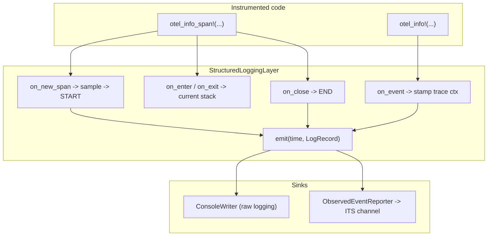

# Self-Tracing Spans: Design and Implementation

This document describes how the OTAP-Dataflow internal telemetry system gains
span support. It covers both the design rationale and the concrete
implementation in the `otap-df-telemetry` crate. It builds on the logging
pipeline described in
[self_tracing_architecture.md](self_tracing_architecture.md) and reuses the
partial OTLP-bytes `LogRecord` representation defined in
`otap_df_telemetry::self_tracing`.

The audience is contributors who want to understand, use, or extend internal
span instrumentation. The reader is assumed to be familiar with Tokio
`tracing`, the OTLP logs data model, and the OpenTelemetry probability
sampling design in OTEP 235 and OTEP 4321.

## Contents

- [Background and motivation](#background-and-motivation)
- [The model: a span is two log events](#the-model-a-span-is-two-log-events)
- [Architecture](#architecture)
- [Design decisions](#design-decisions)
- [Implementation](#implementation)
  - [Module map](#module-map)
  - [Trace context types](#trace-context-types)
  - [Probability sampling math](#probability-sampling-math)
  - [Identifier generation](#identifier-generation)
  - [The sampler interface](#the-sampler-interface)
  - [The sampling driver](#the-sampling-driver)
  - [The Tokio tracing layer](#the-tokio-tracing-layer)
  - [Stamping and OTLP encoding](#stamping-and-otlp-encoding)
  - [Console formatting](#console-formatting)
  - [Context injection](#context-injection)
- [Semantic conventions](#semantic-conventions)
- [Worked example](#worked-example)
- [Allocation and performance](#allocation-and-performance)
- [Public API](#public-api)
- [Testing](#testing)
- [Scope, non-goals, and future work](#scope-non-goals-and-future-work)

## Background and motivation

The original internal telemetry implementation covered structured log events
through the `otel_info!` family of macros but never implemented spans. The
`otel_*_span!` macros are re-exports of Tokio `tracing` span macros, and the
subscriber layer ignored span lifecycle callbacks, so spans produced no output.
The fields attached to a span were captured by the registry but never encoded
or emitted.

We now need spans for causal instrumentation of the engine while keeping the
reliability and low-overhead properties of the existing logging path. The
existing path produces a partially encoded OTLP-bytes `LogRecord` first, which
is cheap to sort, filter, and forward into an internal pipeline. Spans reuse
that same representation.

## The model: a span is two log events

We deliberately reject the stateful span model that Tokio `tracing` and the
OpenTelemetry SDK use, in which a span object accumulates attributes and events
over its lifetime and is emitted once at close. Instead a span surfaces as two
independent log events:

- A START event is emitted when the span opens.
- An END event is emitted when the span closes.

Both events are ordinary `LogRecord` values that travel the existing `LogEvent`
and `ObservedEventReporter` path. Events recorded inside a span through the
`otel_*!` macros are also ordinary `LogRecord` values, stamped with the active
span's trace context. A consumer therefore receives a stream that mixes START
events, END events, and in-span log events. Reassembling these into spans is an
aggregation concern and is out of scope for this document.

The START and END events for one span share the same `trace_id` and `span_id`,
so they correlate by identity. A child span carries its parent identifier so
the parent relationship is expressed as a link. The semantic conventions that
name the two phases and the link attributes are provisional and are listed
below.

This model has three consequences that shape the rest of the design:

1. We never retain a span's evolving attributes or nested events. The only
   per-span state is an immutable identity and sampling context.
2. Span output is gated by a sampler, just as trace sampling gates spans in the
   OpenTelemetry SDK. Log events are not sampled by the trace sampler; they are
   filtered only by level.
3. Because spans and in-span events are all `LogRecord` values, the existing
   console formatter, OTLP encoder, and internal telemetry pipeline carry them
   without new message types.

## Architecture

Spans plug into the existing logging layer. The layer already turns a Tokio
`tracing` `Event` into a `LogRecord` and routes it to the console or an
asynchronous reporter. Span support adds the span lifecycle callbacks and a
sampler, reusing the same `emit` path.



The Tokio `tracing` `Registry` assigns span identifiers, refcounts spans, and
tracks the current span per thread. The layer stores one immutable
`SpanContext` value per live span in the registry's span extensions and reads
it back in the lifecycle callbacks.

## Design decisions

These decision records capture the rationale. The implementation sections that
follow describe how each decision is realized.

### D1: No-allocation trace context

Trace context is a fixed-size `Copy` value with no heap backing. It carries the
W3C identifiers, the trace flags, and only the OpenTelemetry probability
sampling fields `rv` and `th`. Arbitrary vendor `tracestate` members are not
retained, because retaining them would require allocation. This loss is
accepted as the price of a no-allocation context.

### D2: Reuse the Tokio tracing span lifecycle

The subscriber already builds a `tracing_subscriber::Registry`. The registry
records only span metadata and parentage. It does not store recorded field
values, which is exactly the "no live span data" property we want. We reuse
this machinery rather than reimplement a span stack, which gives parent and
child nesting, current-span lookup, and `#[instrument]` support for free.

### D3: Trace context stamped onto LogRecord

`LogRecord` gains one optional `trace` field. When present, the OTLP encoder
writes the `LogRecord` fields that were previously absent, and the console
formatter prints the identifiers. Plain log events outside any span leave the
field unset and encode exactly as before.

### D4: Async propagation by enter and exit tracking

The registry tracks the current span in thread-local state, so context does not
follow a task across an `.await` boundary on its own. The layer maintains a
thread-local stack of active contexts, pushing on span enter and popping on
span exit. A future instrumented with `tracing`'s `Instrument` enters its span
on every poll, so the stack reflects the correct context on whichever worker
thread runs the poll. This mirrors the `NODE_TASK_CONTEXT` task-local pattern
used by the entity context.

### D5: Pluggable sampler interface

The sampler is a trait with composable built-ins ported from the
[jmacd/rust-sampler](https://github.com/jmacd/rust-sampler) prototype for OTEP
235 and OTEP 4321. The port lives in this crate and does not depend on the
`opentelemetry_sdk` `ShouldSample`, `SpanContext`, or `TraceState` types,
because the internal telemetry path has its own manual OTLP encoder and its own
no-allocation context. The first implementation omits sampler-supplied
attributes, so the sampling path allocates nothing.

### D6: Inject interface

Injection writes the active context into an outgoing carrier through a trait
that mirrors the OpenTelemetry propagator setter. The W3C `traceparent` and
`tracestate` values are formatted into stack buffers. Extraction is the
symmetric operation and is a planned follow-up.

### D7: Provisional semantic conventions

The attribute keys that identify the two phases and express the parent link are
provisional and subject to change as the span semantic conventions are
finalized.

## Implementation

### Module map

| Path | Responsibility |
| --- | --- |
| `crates/telemetry/src/self_tracing/span.rs` | Context value types and OTEP 235 math |
| `crates/telemetry/src/self_tracing/sampler.rs` | Sampler trait, samplers, sampling driver |
| `crates/telemetry/src/self_tracing/propagation.rs` | Injector trait and `inject` |
| `crates/telemetry/src/self_tracing.rs` | `LogRecord.trace`, re-exports, semconv keys |
| `crates/telemetry/src/self_tracing/encoder.rs` | OTLP trace fields, attribute helpers |
| `crates/telemetry/src/self_tracing/formatter.rs` | Console trace suffix |
| `crates/telemetry/src/tracing_init.rs` | The span-aware layer and `current_span_context` |
| `crates/telemetry/src/lib.rs` | Public re-exports |

### Trace context types

The context types live in `span.rs`. All of them are `Copy` and never allocate.

```rust
/// A 16-byte W3C trace identifier, stored big-endian as a `u128`.
pub struct TraceId(pub u128);

/// An 8-byte W3C span identifier, stored big-endian as a `u64`.
pub struct SpanId(pub u64);

/// W3C trace flags. Bit 0 is "sampled", bit 1 is "random".
pub struct TraceFlags(u8);

/// OTEP 235 randomness, the low 56 bits used for the sampling decision.
pub struct Randomness(u64);

/// OTEP 235 rejection threshold in the 56-bit space. Sampled when
/// `threshold <= randomness`.
pub struct Threshold(u64);

/// The OpenTelemetry `ot` sub-state, restricted to the sampling fields.
pub struct OtelTraceState {
    pub rv: Option<Randomness>,
    pub th: Option<Threshold>,
}

/// Immutable per-span identity and sampling context.
pub struct SpanContext {
    pub trace_id: TraceId,
    pub span_id: SpanId,
    pub flags: TraceFlags,
    pub ot: OtelTraceState,
}
```

`SpanContext` is the unit of propagation. It is small enough to pass by value,
to stamp into a `LogRecord`, and to store as a single registry extension. It is
never boxed on the hot path.

The identifiers and flags expose big-endian byte accessors for the OTLP wire
format and fixed-width hexadecimal formatters for headers and console output.
The hexadecimal formatters write into a `StackStr<N>`, a small stack buffer of
ASCII bytes with an `as_str` accessor, so formatting never allocates.

### Probability sampling math

`Randomness` and `Threshold` implement the OTEP 235 encoding. The encoding
works in a 56-bit space, where `MAX_ADJUSTED_COUNT` is `2^56` and a value is
sampled when `threshold <= randomness`.

The key operations are:

- `Randomness::from_trace_id` takes the low 56 bits of the trace identifier.
- `Randomness::from_rv_value` parses an explicit `rv` of exactly 14 hexadecimal
  digits.
- `Threshold::from_probability` converts a sampling probability to a threshold,
  raising precision for small probabilities and rounding to a bounded number of
  significant hexadecimal digits.
- `Threshold::from_th_value` parses a `th` of 1 to 14 hexadecimal digits,
  left-aligned in the 56-bit space with implicit trailing zeros.
- `Threshold::is_sampled` compares the threshold against a randomness value.

The hexadecimal formatters round-trip these encodings. `Randomness::to_hex`
produces exactly 14 digits. `Threshold::to_hex` trims trailing zeros and emits
a single `0` for the always-sample threshold. `Threshold::ALWAYS` is `0` and
`Threshold::NEVER` is `2^56`.

### Identifier generation

Root spans need a random trace identifier whose low 56 bits are uniform, so
that randomness derived from the trace id is well distributed. `span.rs`
provides `TraceId::generate` and `SpanId::generate` backed by a per-thread
xorshift64\* generator. The generator is seeded from a process-global counter
and the wall clock, hashed through a randomly keyed hasher so that threads do
not share a sequence. This avoids a dependency on an external random number
generator crate while producing well-distributed identifiers suitable for
sampling.

### The sampler interface

The sampler lives in `sampler.rs`. A `Sampler` returns a `SamplingIntent` given
`SamplingParameters`.

```rust
pub struct SamplingIntent {
    pub threshold: Option<Threshold>,
    pub threshold_reliable: bool,
}

pub struct SamplingParameters<'a> {
    pub parent: Option<SpanContext>,
    pub parent_threshold: Option<Threshold>,
    pub parent_threshold_reliable: bool,
    pub trace_id: TraceId,
    pub randomness: Randomness,
    pub name: &'a str,
    pub kind: SpanKind,
}

pub trait Sampler: Send + Sync + 'static {
    fn sampling_intent(&self, params: &SamplingParameters<'_>) -> SamplingIntent;
}
```

The built-in composable samplers mirror OTEP 4321, restricted to the variants
that do not require sampler-supplied attributes:

```rust
pub enum ComposableSampler {
    AlwaysOn,
    AlwaysOff,
    TraceIdRatio(Threshold),
    ParentThreshold(Box<dyn Sampler>),
    RuleBased(Vec<(Box<dyn Predicate>, Box<dyn Sampler>)>),
}
```

`AlwaysOn` returns a reliable 100% threshold. `AlwaysOff` returns no threshold.
`TraceIdRatio` returns a fixed threshold. `ParentThreshold` honors the
reconciled parent threshold when there is a parent and otherwise delegates to a
root sampler. `RuleBased` evaluates predicates in order and delegates to the
first matching sampler.

A `Predicate` selects a delegate for `RuleBased`. The built-ins are `Always`
and `IsRoot`. Predicates decide on parentage, name, and kind. Attribute-based
predicates are a follow-up, because they would require exposing the span's
initial attributes to the sampler before the START record is built.

### The sampling driver

`evaluate` is the fixed driver that performs the parts that are not pluggable.
It is invoked once per new span by the layer.

```rust
pub fn evaluate(
    sampler: &dyn Sampler,
    parent: Option<SpanContext>,
    trace_id: TraceId,
    span_id: SpanId,
    name: &str,
    kind: SpanKind,
) -> SamplingDecision;
```

The algorithm is:

1. Derive randomness. Randomness is a trace-level property, so the driver
   inherits an explicit `rv` from the parent when present and otherwise derives
   it from the trace identifier.
2. Reconcile the parent threshold. A parent threshold propagates as reliable
   only when it agrees with the parent sampled flag, that is when the threshold
   would sample the shared randomness and the parent flag is set. Otherwise the
   threshold is dropped so it does not propagate inconsistently.
3. Invoke the sampler with the reconciled parameters.
4. Decide sampled when the intent threshold would sample the randomness.
5. Assemble the child context. The threshold propagates as `th` only when the
   sampler marked it reliable. The random flag is inherited, and is set for a
   root span because generated trace ids have uniform low bits. An explicit
   `rv` is preserved when the trace carried one and is otherwise left implicit
   via the random flag.

The result is a `SamplingDecision { sampled, context }`. The `sampled` flag
gates START and END emission, and the `context` is stored for propagation
regardless of the decision.

### The Tokio tracing layer

`StructuredLoggingLayer` in `tracing_init.rs` is the integration point. It gains
a sampler and four span lifecycle callbacks alongside the existing event
callback.

```rust
pub struct StructuredLoggingLayer {
    writer: Option<ConsoleWriter>,
    reporter: Option<ObservedEventReporter>,
    context_fn: LogContextFn,
    sampler: Arc<dyn Sampler>,
}
```

The only per-span state is stored in the registry's span extensions:

```rust
struct SpanState {
    context: SpanContext,
    sampled: bool,
    start: Instant,
}
```

The callbacks are:

- `on_new_span` resolves the parent context from the Tokio span parent chain,
  generates identifiers, runs `evaluate`, stores `SpanState`, and emits a START
  record when the decision is sampled. The parent context is read from the
  parent span's `SpanState`, which exists because the layer stores state for
  every span it sees.
- `on_enter` pushes the span's context onto a thread-local stack.
- `on_exit` pops the stack. Push and pop are balanced because both are guarded
  by the presence of `SpanState`, which is consistent for a given span.
- `on_close` reads `SpanState`, computes the elapsed duration from the stored
  start instant, and emits an END record when the span was sampled.
- `on_event` looks up the event's current span, reads its context, and stamps
  the log record with `with_trace` before emitting.

State is stored even for unsampled spans, so that descendants inherit a correct
context and propagation stays consistent. Only START and END emission is gated
by the decision. In-span log events are always emitted, subject to level
filtering, and carry the span context whether or not the span was sampled.

The thread-local stack also backs the public accessor:

```rust
pub fn current_span_context() -> Option<SpanContext>;
```

This is the value a caller passes to `inject`. It returns the context of the
span currently entered on the calling thread.

The default sampler is `ParentThreshold(AlwaysOn)`, so root spans always record
and children honor the propagated threshold. A caller can replace it with
`with_sampler`. Wiring the sampler through the telemetry configuration is a
follow-up.

### Stamping and OTLP encoding

`LogRecord` gains one field:

```rust
pub struct LogRecord {
    pub callsite_id: Identifier,
    pub body_attrs_bytes: bytes::Bytes,
    pub dropped_attributes_count: u16,
    pub context: LogContext,
    pub trace: Option<SpanContext>,
}
```

The `with_trace` builder sets it. `BorrowedLogRecord` carries the same optional
context for zero-copy formatting.

`DirectLogRecordEncoder::encode_log_record` writes the OTLP `LogRecord` fields
that are otherwise absent when `trace` is present:

- `flags`, field 8, a `fixed32` carrying the trace flags byte.
- `trace_id`, field 9, a length-delimited 16-byte big-endian value.
- `span_id`, field 10, a length-delimited 8-byte big-endian value.

Plain log events leave `trace` unset and encode exactly as before.

The START and END records carry span attributes in their body and attributes
bytes. `encoder.rs` exposes `append_string_attribute` and `append_int_attribute`
so the layer can add the phase, parent span id, and duration attributes after
visiting the span's declared fields with the existing `DirectFieldVisitor`.

### Console formatting

For raw logging, the formatter appends a compact trace suffix when a record
carries context. `StyledBufWriter::write_trace_suffix` writes a leading space
followed by `trace=<32 hex> span=<16 hex>` and is invoked from the shared
`format_log` path, so both the owned and the borrowed formatting paths show it.
Plain log events are unaffected.

### Context injection

`propagation.rs` provides the injection interface.

```rust
pub trait Injector {
    fn set(&mut self, key: &str, value: &str);
}

pub fn inject(context: &SpanContext, injector: &mut dyn Injector);
```

`inject` writes two headers and allocates nothing on the heap, because the
values are formatted into stack buffers:

- `traceparent` is `00-<trace_id:32hex>-<span_id:16hex>-<flags:2hex>`, a string
  of fixed length 55.
- `tracestate` carries the OpenTelemetry member `ot=th:<hex>;rv:<hex>` when a
  threshold or randomness value is present. When neither is present, no
  `tracestate` is written. Only the `ot` member is produced, because other
  vendor members are not retained by the context.

The caller obtains the context from `current_span_context`. Extraction is the
symmetric operation and is a planned follow-up, though `SpanContext` is designed
to support it.

## Semantic conventions

The following attribute keys are defined in `self_tracing.rs`. They are
provisional and subject to change as the span semantic conventions are
finalized.

| Constant | Key | Carried on |
| --- | --- | --- |
| `ATTR_SPAN_PHASE` | `otel.span.phase` | START and END, value `start` or `end` |
| `ATTR_SPAN_PARENT_SPAN_ID` | `otel.span.parent_span_id` | START, parent span id as hex |
| `ATTR_SPAN_DURATION_NANO` | `otel.span.duration_nano` | END, elapsed nanoseconds |

The span name is carried as the `event.name` of both records, derived from the
span macro callsite. The trace identifiers travel in the OTLP `LogRecord`
fields rather than as attributes.

## Worked example

Consider a parent span with a nested child span and one event inside the child:

```rust
let parent = otel_info_span!("parent.span");
let parent_entered = parent.enter();

let child = otel_info_span!("child.span");
let child_entered = child.enter();

otel_info!("work.done", items = 3);

drop(child_entered);
drop(child);
drop(parent_entered);
drop(parent);
```

With the default sampler, the layer emits this ordered stream of log records,
all sharing one `trace_id` shown as `T`:

| Order | Kind | trace_id | span_id | Notable attributes |
| --- | --- | --- | --- | --- |
| 1 | START | T | P | `otel.span.phase=start` |
| 2 | START | T | C | `otel.span.phase=start`, `otel.span.parent_span_id=P` |
| 3 | event | T | C | `event.name=work.done`, `items=3` |
| 4 | END | T | C | `otel.span.phase=end`, `otel.span.duration_nano=...` |
| 5 | END | T | P | `otel.span.phase=end`, `otel.span.duration_nano=...` |

START fires at span creation, before the span is entered. END fires when the
last span handle is dropped, which decrements the registry refcount to zero. The
event is stamped with the child context because the child is the current span
when the event is recorded.

## Allocation and performance

The design keeps the hot path allocation-light.

- A `SpanContext` is `Copy` and is stored as a single registry extension. The
  registry pools and reuses the extension map across spans, so steady-state
  storage performs no new allocation.
- The thread-local current-context stack is a `SmallVec` with inline capacity
  for eight entries, so typical nesting depth does not allocate.
- The sampling driver and the composable samplers allocate nothing.
- Injection formats into stack buffers and allocates nothing.

The incremental cost over the previous logging path is one pooled extension and
a small number of atomic refcount operations per live span, plus the START and
END record encoding for sampled spans. START and END records allocate the same
reference-counted `Bytes` that ordinary log records already allocate.

## Public API

The crate root re-exports the span surface so dependent crates do not add a
direct `tracing` dependency:

- Span macros `otel_trace_span!`, `otel_debug_span!`, `otel_info_span!`,
  `otel_warn_span!`, `otel_error_span!`, and the `OtelSpan` type alias.
- `current_span_context` for reading the active context.
- `inject` and the `Injector` trait for propagation.
- `Sampler`, `ComposableSampler`, and `SpanKind` for configuring sampling.
- `SpanContext`, `TraceId`, `SpanId`, and `TraceFlags` for working with
  context.

The `self_tracing` module additionally re-exports `Randomness`, `Threshold`,
`OtelTraceState`, and `StackStr` for lower-level use.

## Testing

The implementation is covered by unit tests in each module and end-to-end tests
in the layer.

- `span.rs` tests cover identifier hexadecimal round-trips, flag encoding,
  randomness derivation, threshold encoding from probabilities and from `th`
  values, and identifier generation.
- `sampler.rs` tests cover each composable sampler, parent threshold
  reconciliation, and rule-based selection.
- `propagation.rs` tests cover `traceparent` formatting and `tracestate`
  formatting with and without threshold and randomness.
- `encoder.rs` tests confirm the OTLP trace fields round-trip through a decoder
  and are omitted when no context is present.
- `tracing_init.rs` tests drive real spans through the layer and assert the
  emitted stream. A sampled span emits START, an in-span event, and END with
  shared identifiers. An unsampled span suppresses START and END but keeps the
  in-span event. Nested spans inherit the trace id, receive distinct span ids,
  and link to the parent.

Use the targeted per-crate commands to validate changes:

```bash
cd rust/otap-dataflow
cargo test -p otap-df-telemetry --lib
cargo clippy -p otap-df-telemetry --lib --tests -- -D warnings
```

## Scope, non-goals, and future work

In scope and implemented:

- Emitting START and END events with span attributes.
- No-allocation trace context with the OTEP 235 `rv` and `th` fields.
- A pluggable sampler interface with composable built-ins.
- Stamping in-span log events with the active context.
- Context injection.

Out of scope for the initial change:

- Aggregating START, END, and in-span events back into spans.
- Retaining non-OpenTelemetry `tracestate` members, which is precluded by the
  no-allocation context.
- Context extraction, which is a planned follow-up.
- Sampler-supplied attributes and attribute-based sampling predicates.

Known follow-ups:

- Wire the sampler through the telemetry configuration so deployments can
  choose a sampling strategy. The default is `ParentThreshold(AlwaysOn)`, so
  every span currently emits START and END at its level.
- Finalize the span semantic conventions and replace the provisional attribute
  keys.
- Add context extraction to complement injection.
