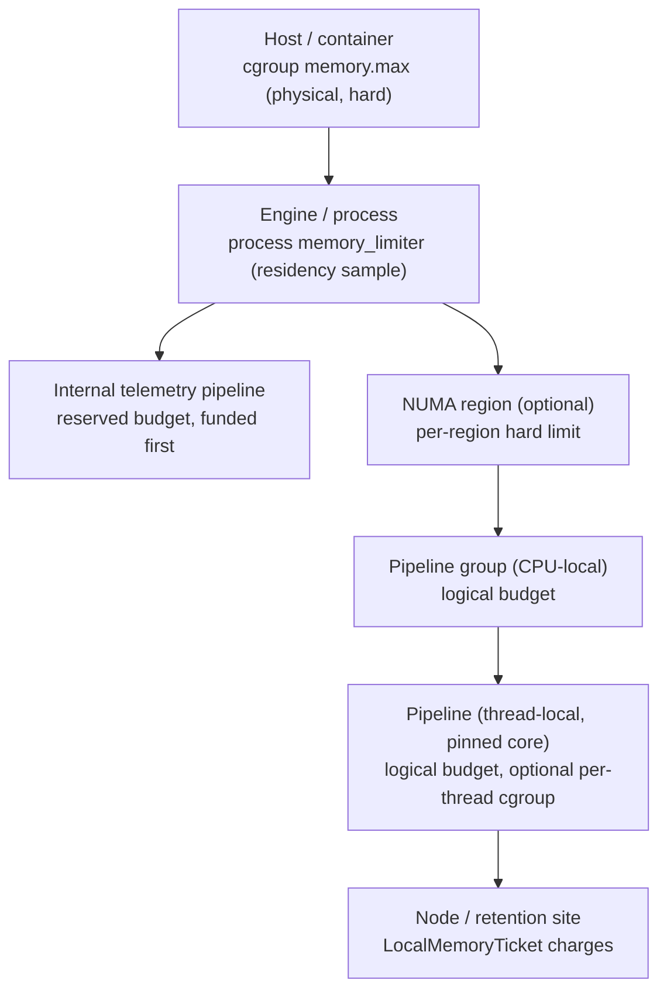

# Unified Memory Limiter Architecture

**Status:** Draft

**Owners:**

- [Joshua MacDonald](mailto:jmacd@microsoft.com)

---

## Goal

This document is an overview-level design for a single, unified way to
budget, limit, and observe memory across the OTAP dataflow engine. It
ties together three efforts that today are described separately:

- the process-wide memory limiter in
  [`memory-limiter-phase1.md`](./memory-limiter-phase1.md), which samples
  real residency and sheds ingress under pressure,
- the observe-only retained-work accounting proposed in
  [otel-arrow#3316](https://github.com/open-telemetry/otel-arrow/pull/3316),
  which attributes admitted bytes to a runtime, a site, and a component,
- and the limiter-as-policy model in the multitenant pipeline design
  ([otel-arrow#3389](https://github.com/open-telemetry/otel-arrow/pull/3389)),
  where rate and resource limits are configured per tenant and per scope.

The unifying idea is simple to state. We start from a total memory
budget, either configured directly or inferred from the container we run
in, and we subdivide that total into the parts of the engine: internal
telemetry, pipeline groups, pipelines, threads, and CPUs. Budgets are
hierarchical, from the hardware level down through engine, NUMA region,
CPU, group, and pipeline. At the leaves we have threads that hold data,
carry tenant tokens, and occupy memory as they route, process, limit,
export, and load balance. At every level the sum of memory in use
decomposes into subtotals, and we can publish those subtotals as one
multidimensional metric for observability by NUMA, CPU, group, pipeline,
and tenant.

This is an architecture overview. The detailed ownership and ticket
mechanics live in otel-arrow#3316, and the per-scope policy
configuration lives in the multitenant design. This document describes
how the layers fit together and what invariants hold across them.

## Background and current state

Three mechanisms exist or are proposed, and each covers one facet of the
problem.

The **process-wide limiter** samples RSS or cgroup memory, classifies
pressure as `Normal`, `Soft`, or `Hard`, and sheds ingress at receiver
boundaries under `Hard` in enforce mode. It sees every resident byte,
including allocator overhead, but it cannot attribute any of it to a
pipeline, a component, or a tenant. It is configured as a policy at
`policies.resources.memory_limiter`, and it supports an `observe_only`
mode alongside `enforce`.

The **retained-work accounting** in otel-arrow#3316 attributes admitted
bytes precisely, by giving every retained item exactly one logical owner
that travels with the data and releases on delivery, drop, or
acknowledgement. It models memory by a declared logical size and does
not attempt to see residency or allocator slack.

The **limiter-as-policy model** in the multitenant design treats rate
and resource limits as configured extensions with a common shape, and
notes that limiter scope can be thread-local for a pipeline, CPU-local
for a pipeline group, global for the engine, and eventually
NUMA-regional.

Three gaps remain between these pieces:

1. There is no single model that subdivides one total budget across the
   engine hierarchy, so residency accounting, logical accounting, and
   per-scope limits are not related to each other by construction.
2. The `memory_limiter` policy is supported only at the top-level
   `policies.resources` scope; group and pipeline overrides are rejected
   during validation, and the dedicated engine observability pipeline
   rejects any `resources` policy at all. There is therefore no way yet
   to give internal telemetry, a group, or a pipeline its own memory
   floor or its own CPU allocation.
3. We have no document stating that cgroups are policies too, and no
   design for hard limits per thread and per NUMA region.

## User stories

The design is driven by a small set of operator-facing stories.

- **Internal telemetry keeps flowing.** The engine's own telemetry is
  the channel operators use to see what is wrong. It should keep flowing
  for the whole process lifetime, and when the process cannot even fund
  its own internal telemetry at startup, it should fail fast with a
  clear error rather than start blind.
- **Fairness under pressure.** When a process is configured with less
  memory than all tenants would like, the most important work should be
  protected while less important tenants are shed, and the accounting
  should show which tenants were squeezed and why.
- **Find the hot spot.** When a process is under memory pressure, an
  operator should be able to say which runtime, which kind of buffer,
  which component, and which tenant is holding the retained work, not
  merely that the process number is high.
- **Know before you promise.** Before admitting traffic, the engine
  should be able to check that its configured budgets fit within the
  memory it actually has, so that infeasible configurations are caught
  at startup rather than discovered as an out-of-memory kill.

## Model: one budget, hierarchically subdivided

### Inferring the total

The root of the hierarchy is a total memory budget for the process. It
is either configured explicitly or inferred from the container, by
reading the cgroup memory limit the same way the phase-1 limiter already
does. The total is the ceiling that every subordinate budget must fit
within, after reserving headroom for allocator overhead and untracked
state.

### The budget tree

Budgets nest along a tree. Each node owns a budget that is a subdivision
of its parent, and the engine can attach a physical cgroup at selected
levels as a hard backstop.

The logical scopes engine, group, pipeline, and site come from the
dataflow model. The physical scopes host, process, NUMA region, and core
thread come from the operating system. A pipeline is pinned to a worker
thread on a core, a pipeline group spans a set of cores that may line up
with a NUMA region, and the engine spans the whole process. Budgets are
declared along the logical tree, and cgroups may be attached at the
process, NUMA, and thread levels where the operating system can enforce
them.

### Conservation invariant

The single invariant that makes the model usable is conservation: at
every node, the sum of the children's budgets plus a reserve is less
than or equal to the node's own budget. Because logical accounting is
conservative and does not count overhead, the reserve at each level
absorbs allocator slack and untracked state. The physical cgroup at a
level, where present, enforces the true ceiling regardless of how good
the logical estimate was.

This invariant lets the engine answer the startup-feasibility story: a
configuration is feasible when the budget tree sums correctly under the
inferred total, and infeasible configurations are rejected before any
traffic is admitted.

### Internal telemetry is a reserved subdivision

Internal telemetry already runs as its own pipeline, the dedicated
engine observability pipeline. In this model it becomes a reserved
subdivision of the engine budget that is funded before any tenant
pipeline. Given its own CPU allocation, a dedicated worker thread, and
optionally its own cgroup, internal telemetry is isolated by
construction rather than by priority arbitration. It keeps flowing while
tenant pipelines are squeezed, because its budget is carved out first
and the operating system protects it. This requires lifting the current
restriction that rejects a `resources` policy on the observability
pipeline.

### Tenants are a cross-cutting dimension

Tenancy does not add a new level to the tree; it cuts across it. Data
carries tenant tokens, the resolved tenant descriptors from the
multitenant design, and those tokens follow the data through whatever
thread, group, and pipeline retains it. Tenant budgets are therefore
expressed either by routing a tenant to a dedicated pipeline, which
turns tenant isolation into a tree subdivision, or by a per-tenant
resource limiter within a scope, which keeps tenant as a label on the
shared budget. Both are supported, and the choice is a configuration
matter.

## Two classes of limit

The engine limits two different kinds of thing with the same interface,
and it is worth naming the difference because memory sits astride it.

### Physical limits: the higher power

Physical limits are enforced by the operating system: a cgroup
`memory.max` on the process, and, where we choose to place them, hard
limits per NUMA region and per worker thread. These limits count real
residency, including allocator overhead and fragmentation, and they are
authoritative. When a physical limit is hit, there is a higher power
than the engine, and the outcome is a kernel decision such as an
allocation failure or an out-of-memory kill. The engine's job is to stay
comfortably under these limits, not to reason about the exact byte.

### Logical limits: conservative and ticketed

Logical limits are enforced inside the engine by counting a declared
logical size for each unit of retained work, following the ticket design
in otel-arrow#3316. A `LocalMemoryTicket` owns a charge while data stays
on one pinned runtime, and an `EscrowTicket` owns the charge once the
work crosses a shared boundary. These charges model memory by size only.
They deliberately do not count allocator overhead, do not query
`size_of_val` or the allocator, and report sites that cannot estimate a
size as unknown rather than guessing. Logical accounting is therefore a
conservative under-estimate of residency, precise about attribution but
blind to overhead.

### How they compose

The two classes are complements, not alternatives, and they line up with
the two facets we already have.

<!-- markdownlint-disable MD013 -->
| Aspect | Physical limit | Logical limit |
| --- | --- | --- |
| Enforced by | Operating system (cgroup, kernel) | Engine (ticket + semaphore) |
| Counts | Real residency, including overhead | Declared logical size only |
| Attribution | None | Runtime, site, component, tenant |
| Failure mode | Allocation failure, OOM kill | Admission wait or rejection |
| Role | Hard backstop, the higher power | Fine-grained budgeting and insight |
| Existing basis | phase-1 limiter, cgroups | otel-arrow#3316 ticketing |
<!-- markdownlint-enable MD013 -->

Because logical totals under-count and physical limits over-count
relative to what the pipeline logically holds, the two bound the truth
from both sides. The headroom reserve in the conservation invariant is
exactly the gap we leave between the logical budget and the physical
ceiling so that the physical limit is a backstop and not a routine
trigger.

## ResourceLimiter as the common primitive

The multitenant design's resource limiter, with its `acquire` and
`release` interface, is the natural primitive for every level of this
hierarchy. A resource limiter limits the concurrent total of some
weight, and it is agnostic to what the weight measures. It can count
requests in flight, items in a queue, bytes on disk, or bytes of memory.
This generality is what lets one mechanism serve both the physical and
the virtual side of the design.

For memory specifically, a semaphore-style resource limiter at each
scope holds that scope's budget. A ticket acquires against the nearest
scope budget when retention starts and releases when retention ends, and
the charge rolls up the tree so that a parent scope sees the sum of its
children. The `acquire` and `release` contract is appropriate here in
the generic sense: the caller reserves a logical amount and returns it
when the work is done.

The one caveat, which the physical layer exists to handle, is that
memory has a higher power. A logical `acquire` that succeeds is a
statement about modeled size, not a guarantee from the allocator. We are
being deliberately conservative when we model memory by size and ignore
overhead, and we lean on the physical cgroup to enforce the real ceiling
when the model and reality diverge.

## Cgroups are policies too

We have documents describing memory limits as policy and describing CPU
core allocation as policy, but none stating plainly that cgroup
placement is also a policy. This design makes that explicit. A cgroup is
a physical `resources` policy that can be declared at the scopes where
the operating system can enforce it: the process, a NUMA region, and a
worker thread. It sits alongside the existing `core_allocation` policy,
which already supports pinning a pipeline to a specific set of cores
through `all_cores`, `core_count`, and `core_set`.

Two extensions to the current policy model follow:

- The `memory_limiter` policy, today restricted to the top-level scope,
  becomes available per scope, so a group, a pipeline, or the internal
  telemetry pipeline can declare its own memory floor and ceiling.
- A new physical cgroup policy expresses hard limits per thread and per
  NUMA region, so that the reserved subdivisions, most importantly
  internal telemetry, are protected by the kernel and not only by the
  engine's own bookkeeping.

Both extensions keep the same rule the multitenant design already
insists on: the hot path stays runtime-local, and no global
synchronization is introduced by adding a limiter or a cgroup at a
scope.

## Enforcement mechanics

The model is meant to be adopted in the same staged way the retained-work
accounting proposes, so that measurement is trusted before control is
switched on.

1. **Observe only.** Tickets charge and release, budgets are declared,
   and the engine publishes retained and budgeted bytes per scope. No
   traffic is rejected. This is the phase where attribution is
   validated, matching the `observe_only` posture of both the phase-1
   limiter and otel-arrow#3316.
2. **Enforce logically.** Scope budgets begin to admit and backpressure
   at explicit boundaries when a subdivision would exceed its logical
   budget. Rejection belongs at admission points, not scattered through
   the pipeline.
3. **Backstop physically.** Cgroups at the process, NUMA, and thread
   levels enforce the hard ceilings, and the process-wide limiter
   remains the final guard that sheds ingress under real pressure.

The three layers are ordered from most attributable and least
authoritative to least attributable and most authoritative. Logical
enforcement acts first because it knows who owns what; the physical
backstop acts last because it is the higher power.

## Observability

The payoff of subdividing one total is that the total decomposes into
subtotals that add up. The engine publishes a single multidimensional
`UpDownCounter` for retained memory, so that any slice of the hierarchy
can be read off by aggregating over the other dimensions.

<!-- markdownlint-disable MD013 -->
| Dimension | Purpose |
| --- | --- |
| NUMA region | Which memory region holds the work |
| CPU / core | Which worker thread holds the work |
| Pipeline group | Which CPU-local group owns the budget |
| Pipeline | Which thread-local pipeline owns the budget |
| Tenant | Which tenant token the retained work carries |
| Retention site | Queue, batch, retry, router, topic, or exporter |
| Component | Which receiver, processor, or exporter |
<!-- markdownlint-enable MD013 -->

Alongside the retained-bytes counter, each scope publishes its declared
budget and its headroom, so an operator can see not just where memory is
held but how close each subdivision is to its own limit. These logical
metrics complement, and do not replace, the residency gauges the phase-1
limiter already emits, such as `memory_rss` and `memory_pressure_state`.

Tenant is the one dimension that needs care, because tenant values can be
sensitive or high-cardinality even when bucket counts are bounded.
Tenant labeling should follow the same policy the multitenant design
adopts for limiter metrics, which may mean bucketed, hashed, or disabled
by default.

## How the model satisfies the user stories

- **Internal telemetry keeps flowing** because it is a reserved
  subdivision with its own thread and optionally its own cgroup, funded
  before any tenant pipeline. When the inferred total cannot even fund
  that reserved subdivision, the startup-feasibility check fails and the
  process can exit with a clear error instead of starting blind.
- **Fairness under pressure** falls out of per-scope and per-tenant
  budgets. The reserved subdivisions are protected while other tenants'
  budgets are the ones that backpressure or shed, and the accounting
  shows which tenants were squeezed.
- **Find the hot spot** is answered directly by the multidimensional
  counter, which names the runtime, the site, the component, and the
  tenant holding retained work.
- **Know before you promise** is the conservation invariant checked at
  startup: budgets that do not fit under the inferred total are rejected
  before traffic is admitted.

## Non-goals

- This document does not specify the ticket types, traits, or release
  paths; those belong to otel-arrow#3316.
- It does not specify tenant descriptor resolution or the limiter
  configuration surface; those belong to the multitenant design.
- It does not attempt to reconcile logical bytes with allocator
  residency. The two are related by a headroom reserve, not by equality.
- It does not define an eviction or reclaim policy for components that
  are over budget; that is a later phase.

## Open questions

- How is a NUMA region modeled as a first-class scope, and how does a
  pipeline group's core set map onto it?
- Is a per-thread cgroup practical on the target platforms, or is
  per-thread limiting better done logically with the cgroup applied only
  at the process and NUMA levels?
- How is the headroom reserve at each level sized, and is it a fixed
  fraction, a configured amount, or derived from observed overhead?
- When several limiters guard one admission, how do they reserve and
  commit together so that an earlier grant is not wasted when a later
  limiter denies, the reserve-and-commit question raised in the
  multitenant design?
- How does the budget tree respond to live reconfiguration when
  pipelines and tenants are added or removed at runtime?

## Relationship to other documents

- [`memory-limiter-phase1.md`](./memory-limiter-phase1.md) is the
  process-wide residency backstop and the source of the inferred total.
  Its "Relationship to Later Phases" list, which includes per-pipeline
  budgets, per-core leases, and `MemoryTicket` ownership, is the work
  this architecture organizes.
- [otel-arrow#3316](https://github.com/open-telemetry/otel-arrow/pull/3316)
  is the ticketing implementation for logical, attributable retained-work
  accounting.
- [otel-arrow#3389](https://github.com/open-telemetry/otel-arrow/pull/3389)
  is the multitenant pipeline design that defines tenant tokens, the
  resource limiter interface, and limiter-as-policy configuration.
